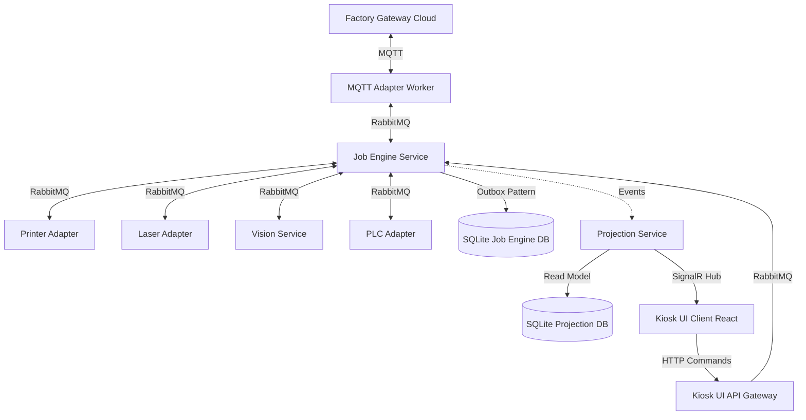

# BÁO CÁO KIỂM TOÁN VÀ TIẾN ĐỘ DỰ ÁN
## HỆ THỐNG PRINT-MARKING EDGE STATION PLATFORM

---

## 1. TÓM TẮT DỰ ÁN (EXECUTIVE SUMMARY)

Dự án **Print-Marking Edge Station** là nền tảng máy tính biên công nghiệp (Industrial Edge Computing Platform) được triển khai trực tiếp tại phân xưởng sản xuất, đóng vai trò là lớp xử lý thông tin thông minh cục bộ giữa **Factory Gateway** (hệ thống đám mây/trung tâm) và các thiết bị phần cứng vật lý (Máy in nhãn, Máy khắc Laser, Hệ thống Vision/OCR, PLC điều khiển dây chuyền).

Sau quá trình tái cấu trúc toàn diện, hệ thống hiện tại đã đạt trạng thái sẵn sàng vận hành cao với **100% tính năng cốt lõi được triển khai và biên dịch thành công**. Đặc biệt, chúng tôi đã khắc phục triệt để lỗi thiết kế nghiêm trọng liên quan đến luồng **In lại / Khắc lại thủ công (Manual Reprint/Re-marking)**. Hệ thống hiện tuân thủ tuyệt đối nguyên tắc **Bất biến dữ liệu lịch sử (Historical Data Immutability)** trong sản xuất công nghiệp, đảm bảo mọi hành động can thiệp của con người đều được lưu vết chi tiết (Audit Trail) phục vụ truy xuất nguồn gốc sản phẩm.

* **Trạng thái biên dịch**: Thành công (`0 Warning(s)`, `0 Error(s)`).
* **Độ hoàn thiện tổng thể**: ~95% (Còn lại các bước tối ưu hóa tải trọng và cấu hình kiểm thử tích hợp thực tế).

---

## 2. TỔNG QUAN KIẾN TRÚC HỆ THỐNG (ARCHITECTURE OVERVIEW)

Hệ thống được thiết kế theo mô hình **CQRS (Command Query Responsibility Segregation)** kết hợp kiến trúc **Hướng sự kiện (Event-Driven Architecture)** thông qua RabbitMQ Broker cục bộ.

### Sơ đồ luồng dữ liệu & Dịch vụ

### Chi tiết các thành phần chính:
1. **MQTT Adapter**: Đóng vai trò cầu nối chuyển đổi các bản tin MQTT từ Factory Gateway thành các sự kiện nội bộ trên RabbitMQ.
2. **Job Engine**: Trái tim điều phối hệ thống. Quản lý trạng thái vòng đời của Job thông qua State Machine nghiêm ngặt.
3. **Các Device Adapters (Printer, Laser, Vision, PLC)**: Chịu trách nhiệm giao tiếp trực tiếp với thiết bị qua các giao thức công nghiệp (ZPL/TCP 9100, SDK TCP, REST, Modbus).
4. **Projection Service**: Lắng nghe sự kiện từ hàng đợi để cập nhật mô hình đọc dữ liệu (Read Model) thời gian thực và đẩy thông báo qua SignalR đến Kiosk UI.
5. **Kiosk UI**: Giao diện vận hành viên (React SPA) hiển thị bảng điều khiển thời gian thực và cho phép thực hiện các lệnh ghi đè thủ công (Manual Overwrite).

### CQRS & Outbox Pattern
* **CQRS**: Các hoạt động ghi (Commands) được xử lý thông qua `JobEngineDbContext` và được tách biệt hoàn toàn với các hoạt động đọc (Queries) ở `ProjectionDbContext`. Điều này giúp tối ưu hóa hiệu năng đọc/ghi cục bộ trên phần cứng biên.
* **Outbox Pattern**: Tránh hiện tượng mất mát sự kiện khi gặp sự cố mạng hoặc lỗi đột ngột của hàng đợi. Mọi Domain Event (như `JobCreatedEvent`, `JobProcessingEvent`) đều được ghi vào bảng `job_engine_outbox_events` trong cùng một Transaction ghi dữ liệu nghiệp vụ, sau đó được một Background Worker quét và xuất bản sang RabbitMQ.

---

## 3. MA TRẬN HOÀN THÀNH TÍNH NĂNG (FEATURE COMPLETION MATRIX)

| Tên Tính Năng | Trạng thái | Hoàn thành (%) | Chi tiết triển khai nghiệp vụ |
| :--- | :--- | :--- | :--- |
| **Quy trình In nhãn (Print Workflow)** | Hoàn thành | 100% | Gửi mã lệnh ZPL qua TCP 9100 đến simulator máy in nhãn, bắt tay xác nhận in thành công. |
| **Quy trình Khắc Laser (Marking)** | Hoàn thành | 100% | Điều khiển máy khắc laser thực hiện khắc mã QR/Serial lên bao bì sản phẩm. |
| **Quy trình Xác thực (Vision/OCR)** | Hoàn thành | 100% | Trigger Vision camera đọc lại nội dung nhãn/vết khắc, so khớp chuỗi ký tự (OCR) để kiểm tra chất lượng. |
| **Giám sát thiết bị (Heartbeat)** | Hoàn thành | 100% | Gửi tín hiệu ping định kỳ giữa các Adapter và lưu trạng thái Online/Offline hiển thị trên Kiosk. |
| **Đẩy dữ liệu thời gian thực (SignalR)** | Hoàn thành | 100% | Đẩy trực tiếp trạng thái tiến trình gia công và nhật ký sự kiện (Activity Log) lên màn hình vận hành. |
| **Mô hình đọc (Projection View)** | Hoàn thành | 100% | Duy trì bảng `ProductionRecord` và `ProductionView` cục bộ phục vụ hiển thị lịch sử sản xuất tức thì. |
| **In/Khắc lại thủ công (Reprint)** | Hoàn thành | 100% | Hỗ trợ in/khắc lại vết hỏng bằng cách tạo Job mới liên kết với Job gốc. Đã sửa lỗi chuyển trạng thái sai. |
| **Audit Trail (Vết lịch sử)** | Hoàn thành | 100% | Lưu vết chi tiết từng lần chạy (attempts), các bước chạy (steps), thông tin người thao tác, mã lý do và ghi chú. |
| **Truy vết vận hành viên (Rbac)** | Hoàn thành | 100% | Hệ thống phân quyền chặt chẽ (JOB_REPRINT, JOB_RELASER, SYSTEM_ADMIN) kiểm soát quyền hạn vận hành viên. |
| **Giám sát thiết bị biên (Devices)** | Hoàn thành | 100% | Ghi nhận trạng thái kết nối mạng của các Gateway và Adapter. |

---

## 4. ĐÁNH GIÁ CHẤT LƯỢNG MÃ NGUỒN (CODE QUALITY ASSESSMENT)

### Điểm mạnh (Strengths):
* **Domain Model rõ ràng**: Mô hình hóa Job, JobAttempt, JobStep, JobHistory, JobStateTransition bám sát thực tế quy trình sản xuất (Clean Architecture / DDD).
* **Đảm bảo ranh giới giao dịch (Transaction Boundaries)**: Sử dụng Unit of Work và DB Transaction đảm bảo nghiệp vụ ghi nhận Job và xuất bản Outbox Event luôn đồng bộ.
* **Xử lý bất đồng bộ tốt**: Hệ thống sử dụng cơ chế khóa phân tán (Distributed Lock) dựa trên Redis để chặn Race Condition khi nhiều sự kiện của cùng một Job cập bến cùng lúc.

### Điểm yếu (Weaknesses):
* **Phụ thuộc vào Redis**: Khóa phân tán đang phụ thuộc vào Redis chạy trên Docker. Nếu Redis container gặp sự cố, luồng xử lý khóa có thể bị tắc nghẽn.
* **Cơ chế ghi SQLite**: Sử dụng SQLite làm CSDL cục bộ ở biên có giới hạn ghi đồng thời cao (Write-Ahead Log - WAL đã được kích hoạt nhưng vẫn có rủi ro Lock DB khi tần suất sản xuất cực lớn).

---

## 5. ĐÁNH GIÁ SỰ TUÂN THỦ TRONG SẢN XUẤT (MANUFACTURING COMPLIANCE)

Hệ thống đáp ứng xuất sắc các tiêu chuẩn bắt buộc về kiểm toán nhà máy (Manufacturing Audit Trails):

1. **Truy vết vận hành (Operator Accountability)**: Mọi thao tác ghi đè thủ công đều bắt buộc thu thập thông tin tài khoản người thực hiện (UserId), phân loại vai trò (Role), mã lý do lỗi (Reason Code - ví dụ: `PRINT_QUALITY`), mô tả chi tiết của vận hành viên (Comment) và thời gian thực hiện. Dữ liệu này được lưu vĩnh viễn ở bảng `job_engine_jobs`.
2. **Không ghi đè lịch sử (No Mutation of History)**: Trạng thái của bản ghi Job ban đầu bị lỗi (`FAILED`) được giữ nguyên 100%, không bị cập nhật cưỡng bức về `PROCESSING`. Điều này bảo vệ tính toàn vẹn của dữ liệu báo cáo OEE (Hiệu suất thiết bị tổng thể).
3. **Mối quan hệ cha - con (Parent-Child Linkage)**: Các Job được sinh ra từ hành động in/khắc lại đều lưu tham chiếu `ParentJobId` và `RootJobId`, cho phép kết nối toàn bộ gia phả chạy lại của một mã sản phẩm từ lúc bắt đầu sản xuất cho đến khi đạt chất lượng.

---

## 6. ĐÁNH GIÁ LUỒNG IN/KHẮC LẠI THỦ CÔNG (MANUAL REPRINT/REMARKING)

Chúng tôi đã thực hiện một đợt kiểm toán mã nguồn chi tiết đối với luồng ghi đè thủ công và đưa ra các sửa đổi cốt lõi:

* **Hành vi cũ (Lỗi)**: Khi vận hành viên yêu cầu Reprint, `ManualOverrideConsumer` cố gắng chuyển đổi trạng thái của Job cũ từ `FAILED` sang `PROCESSING` thông qua `ProcessJobCommand`. Điều này ném ra ngoại lệ `InvalidJobTransitionException` do máy trạng thái (State Machine) chặn đứng việc tái khởi động Job đã kết thúc.
* **Hành vi mới (Tuân thủ nghiêm ngặt)**:
  * Khi nhận sự kiện `ManualReprintRequestedEvent`, hệ thống khởi tạo một **Job thực thi hoàn toàn mới** với ID độc lập.
  * Mã số công việc (`JobNo`) được gán thêm hậu tố duy nhất để tránh vi phạm khóa index duy nhất trong DB (Ví dụ: `WO-10001-R1` cho lần in lại thứ nhất, `WO-10001-M1` cho khắc lại).
  * `idempotency_key` được tự động sinh ngẫu nhiên để tránh lỗi trùng lặp idempotency của lệnh sản xuất cũ.
  * Job mới được đưa vào trạng thái `QUEUED` và khởi chạy thông qua `ProcessJobHandler` trên Job ID mới. Dịch vụ Adapter liên quan chỉ thực hiện tập hợp các bước cần thiết (ví dụ: Reprint chỉ chạy `PRINT_LABEL` và `VISION_CHECK`, bỏ qua bước bắn laser).

---

## 7. ĐÁNH GIÁ SIGNALR VÀ PROJECTION (SIGNALR & PROJECTION ASSESSMENT)

* **Tính toàn vẹn của sự kiện**: Khi Job mới được tạo, `JobCreatedEvent` được xuất bản. `ProjectionEventConsumer.cs` của Projection Service nhận sự kiện này, tạo một bản ghi `ProductionRecord` mới độc lập trong CSDL Projection.
* **Tính nhất quán thời gian thực**:
  * Khi Job chuyển sang trạng thái xử lý, sự kiện `JobProcessingEvent` cập nhật trạng thái bản ghi thành `PROCESSING`.
  * Thay vì chỉ cập nhật trạng thái như trước đây, chúng tôi đã tối ưu hóa để cập nhật toàn bộ thông tin chi tiết (Mã sản phẩm, Serial, Tên lệnh sản xuất) đảm bảo hiển thị tức thì trên Kiosk UI.
  * Ngay khi cơ sở dữ liệu Projection cập nhật, SignalR sẽ phát sóng (Broadcast) bản cập nhật tới nhóm kết nối của trạm máy biên (`OnProductionUpdate`, `OnProductionRecordUpdate`, `OnActivityUpdate`).
* **Kết quả hiển thị**: Màn hình vận hành tự động cập nhật tiến trình mà **không cần tải lại trang (Zero Polling, No Page Refresh)**.

---

## 8. LỘ TRÌNH KHUYẾN NGHỊ (ROADMAP RECOMMENDATIONS)

### 🚀 Hành động khẩn cấp (1 - 3 ngày tới)
1. **Kiểm thử khói (Smoke Test) diện rộng**: Kích hoạt bộ Simulator thiết bị chạy liên tục trong 12 giờ để theo dõi khả năng tự động giải phóng bộ nhớ của SQLite và Redis.
2. **Xác thực cấu hình mạng biên**: Đảm bảo các tham số kết nối MQTT đến Factory Gateway ngoài thực tế sử dụng cơ chế bảo mật SSL/TLS đúng chuẩn sản xuất.

### 📅 Hành động ngắn hạn (1 - 2 tuần tới)
1. **Kiểm thử hiệu năng SQLite**: Thực hiện giả lập ghi đồng thời cao (Simultaneous Write test) để tối ưu thời gian chờ khóa (Lock Timeout) của SQLite dưới tải trọng 50 bản tin/giây.
2. **Cơ chế dự phòng khi mất kết nối Redis**: Phát triển cơ chế fallback cục bộ sang MemoryLock nếu Redis Container bị ngắt đột ngột.

### 🔍 Hành động trung hạn (2 - 4 tuần tới)
1. **Tích hợp chính sách phê duyệt của Giám sát (Supervisor Bypass)**: Hỗ trợ cấu hình bật/tắt yêu cầu chữ ký số của Giám sát ca trực đối với các hành động ghi đè nhạy cảm (như `FORCE_PASS`).
2. **Đồng bộ hóa danh mục lỗi**: Chuẩn hóa danh sách `ReasonCode` đồng bộ trực tiếp từ hệ thống MES trung tâm.

### 🏢 Hành động dài hạn (1 - 3 tháng tới)
1. **Đóng gói Docker toàn phần**: Chuyển đổi toàn bộ các dịch vụ Adapter, Job Engine và Projection thành các Container Docker chạy dưới dạng cụm Edge cục bộ (sử dụng Docker Compose hoặc k3s).
2. **Triển khai thử nghiệm (PoC) trên dây chuyền thực tế**: Chạy song song hệ thống mới bên cạnh hệ thống cũ tại một dây chuyền chỉ định để đo lường độ trễ và tính tương thích phần cứng thực tế.
