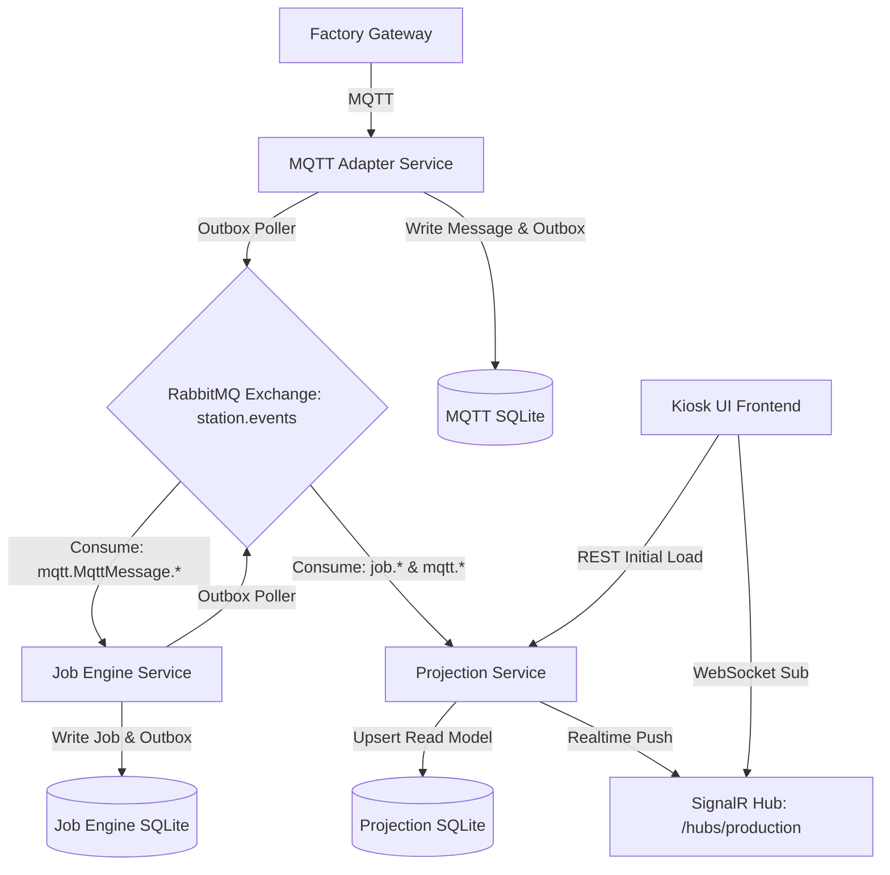

# Realtime Kiosk Architecture — Overview

This document outlines the event-driven real-time architecture implemented for the Print & Marking Station Agent.

## Architecture Diagram

## Service Responsibilities

### 1. MQTT Adapter Service
- Binds to MQTT broker.
- Receives inbound requests from the factory gateway.
- Uses a transactional Unit of Work to write raw payloads into the local `mqtt_messages` database table and a pending event to the `mqtt_outbox_events` outbox table.
- A background worker polls the outbox and publishes the `mqtt.MqttMessage.MqttMessageReceived` event to the `station.events` RabbitMQ exchange.

### 2. Job Engine Service
- Consumes the `mqtt.MqttMessage.MqttMessageReceived` event from RabbitMQ.
- Creates a new `Job` record and starts processing it.
- Writes corresponding outbox events (`JobCreatedEvent`, `JobProcessingEvent`, etc.) to the local `job_engine_outbox_events` table.
- A background worker polls the outbox and publishes `job.created`, `job.processing`, etc., events to the `station.events` RabbitMQ exchange.

### 3. Projection Service (Read Model)
- A new standalone service that listens to both `mqtt.*` and `job.*` events from RabbitMQ.
- Computes and maintains a materialized view of:
  - `production_view`: The current active job SKU, work order number, serial number, status, and update timestamp at the station.
  - `activity_log`: A list of the latest 10 production events (MQTT request received, job queued, job processing started, job completed/failed).
  - `device_status`: The connection status of PLC, Printer, Laser, and Vision Camera.
- Exposes REST endpoints for fast initial Kiosk UI load.
- Exposes a SignalR Hub (`/hubs/production`) for pushing sub-second state changes to subscribers.

### 4. Kiosk UI (Frontend)
- Connects directly to the Projection Service's SignalR Hub on startup.
- Displays real-time station metrics, device connectivity, and a live scrollable activity stream.
- No longer polls or directly queries multiple microservices, satisfying CQRS.
