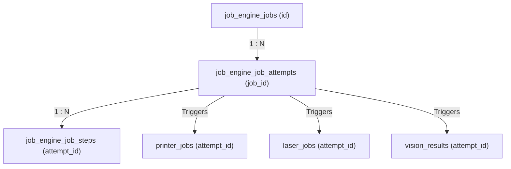

# Database Dictionary — Print-Marking Edge Station

This document serves as the canonical technical database catalog for the Print-Marking Edge Station. The station implements a **Database-Per-Service** architecture, deploying **8 isolated SQLite databases** on the edge IPC.

---

## 1. System Overview

| Database | Service Owner | Primary Role | Table Count |
|---|---|---|:---:|
| **`mqtt.db`** | `mqtt-adapter` | Telemetry & Outbox message buffering | 2 |
| **`job_engine.db`** | `job-engine` | State machine & step execution engine | 7 |
| **`kiosk.db`** | `kiosk-ui` | Authentication, RBAC, and supervisor audit log | 8 |
| **`printer.db`** | `printer-adapter` | Printers, label templates, history & designer snapshots | 6 |
| **`laser.db`** | `laser-adapter` | Laser engraving parameters & job log | 3 |
| **`vision.db`** | `vision-service` | Cameras catalog & QC scanning inspection results | 2 |
| **`plc.db`** | `plc-adapter` | PLC controllers, events & robot pick records | 4 |
| **`projection.db`** | `projection-service` | Read-model cache for Kiosk UI & SignalR broadcasts | 4 |

Total: **36 Tables** across **8 databases**.

---

## 2. Database Schemes in Detail

### 2.1 MQTT Database (`mqtt.db`)

Provides message logging for inbound/outbound MQTT packets and buffers outbound events via the Outbox pattern.

#### Table: `mqtt_messages`
Goal: Maintain a persistent audit trail of all JSON payloads exchanged with the Factory Gateway.

| Column | Type | Constraints | Description / Goal |
|---|---|---|---|
| `id` | TEXT | PRIMARY KEY, NOT NULL | Unique database record ID |
| `message_id` | TEXT | NOT NULL | Canonical MQTT message correlation ID |
| `topic` | TEXT | NOT NULL | Target MQTT Topic name |
| `payload_json` | TEXT | NOT NULL | Raw JSON text of payload |
| `direction` | TEXT | NOT NULL | `INBOUND` (received) or `OUTBOUND` (sent) |
| `status` | TEXT | NOT NULL | Processing state: `RECEIVED`, `PROCESSED`, `FAILED` |
| `received_at` | TEXT | NOT NULL | Timestamp when message arrived on socket |
| `processed_at` | TEXT | NULL | Timestamp when parsed and dispatched |
| `error_message` | TEXT | NULL | JSON parsing or validation exception details |
| `created_at` | TEXT | NOT NULL | Record creation timestamp |

#### Table: `mqtt_outbox_events`
Goal: Implement the transaction outbox pattern to guarantee event delivery back to the Factory Gateway.

| Column | Type | Constraints | Description / Goal |
|---|---|---|---|
| `id` | TEXT | PRIMARY KEY, NOT NULL | Unique outbox event ID |
| `aggregate_type` | TEXT | NOT NULL | Name of source entity (e.g. `Job`) |
| `aggregate_id` | TEXT | NOT NULL | Primary key ID of source entity |
| `event_type` | TEXT | NOT NULL | Business event name (e.g. `PRINT_COMPLETED`) |
| `payload_json` | TEXT | NOT NULL | Serialized JSON data sent in event |
| `topic` | TEXT | NOT NULL | Target MQTT topic for sync |
| `status` | TEXT | NOT NULL | Outbox status: `PENDING`, `PUBLISHED`, `FAILED` |
| `retry_count` | INTEGER | NOT NULL | Number of retry publishing attempts |
| `next_retry_at` | TEXT | NULL | Delay timestamp before next publication |
| `published_at` | TEXT | NULL | Timestamp when gateway acknowledged |
| `created_at` | TEXT | NOT NULL | Record creation timestamp |

---

### 2.2 Job Engine Database (`job_engine.db`)

Coordinates execution stages and retries for production runs.

#### Table: `job_engine_jobs`
Goal: Persistent state machine for every manufacturing job instructed by the gateway.

| Column | Type | Constraints | Description / Goal |
|---|---|---|---|
| `id` | TEXT | PRIMARY KEY, NOT NULL | Unique Job ID |
| `job_no` | TEXT | NOT NULL, UNIQUE | Human-readable work order index |
| `source_system` | TEXT | NOT NULL | Trigger system (e.g. `MES`, `ERP`) |
| `job_type` | TEXT | NOT NULL | Action sequence constant (e.g. `PRINT_ONLY`) |
| `current_status` | TEXT | NOT NULL | State: `CREATED`, `QUEUED`, `PROCESSING`, `FAILED` |
| `product_code` | TEXT | NOT NULL | Product SKU/Model ID |
| `product_serial` | TEXT | NULL | Assigned barcode/traceability serial |
| `payload_json` | TEXT | NOT NULL | Complete instructions/recipe parameter settings |
| `priority` | INTEGER | NOT NULL | Scheduling weight (higher executes first) |
| `idempotency_key` | TEXT | NOT NULL | Prevents duplicate job creations |
| `completed_at` | TEXT | NULL | Timestamp when final step passed |
| `parent_job_id` | TEXT | NULL, FK | Parent Job ID in case of sub-flows |
| `root_job_id` | TEXT | NULL, FK | Root ancestor Job ID |
| `retry_sequence` | INTEGER | NOT NULL, DEFAULT 0 | Counter for rework repetitions |
| `execution_type` | TEXT | NULL | `OriginalProduction` or `Rework` |
| `triggered_by_user_id` | TEXT | NULL | Operator ID if manually requested |
| `reason_code` | TEXT | NULL | Override explanation key |
| `reason_description` | TEXT | NULL | Free-form supervisor overwrite details |
| `created_at` | TEXT | NOT NULL | Record creation timestamp |
| `updated_at` | TEXT | NOT NULL | Last modification timestamp |

**Relationships:**
* `parent_job_id` references `job_engine_jobs.id` (self-referencing sub-job hierarchy).
* `root_job_id` references `job_engine_jobs.id`.

#### Table: `job_engine_job_attempts`
Goal: Track each execution sequence of a job, supporting auto/manual retries.

| Column | Type | Constraints | Description / Goal |
|---|---|---|---|
| `id` | TEXT | PRIMARY KEY, NOT NULL | Attempt ID |
| `job_id` | TEXT | NOT NULL, FK | Reference to parent job |
| `attempt_no` | INTEGER | NOT NULL | Incrementing try count (1, 2, 3...) |
| `trigger_type` | TEXT | NOT NULL | `AUTO`, `MANUAL_RETRY`, or `OVERWRITE` |
| `triggered_by_user_id` | TEXT | NULL | Operator username |
| `result_status` | TEXT | NOT NULL | Outcome: `SUCCESS` or `FAILED` |
| `started_at` | TEXT | NOT NULL | Attempt start timestamp |
| `finished_at` | TEXT | NULL | Attempt conclusion timestamp |
| `error_message` | TEXT | NULL | Main failure exception |
| `parent_attempt_id` | TEXT | NULL, FK | Reference to original failed attempt |
| `retry_sequence` | INTEGER | NOT NULL, DEFAULT 0 | Rework counter |
| `reason_code` | TEXT | NULL | Standard failure code |
| `reason_description` | TEXT | NULL | Custom notes |
| `created_at` | TEXT | NOT NULL | Record creation timestamp |

**Relationships:**
* `job_id` references `job_engine_jobs.id`.
* `parent_attempt_id` references `job_engine_job_attempts.id` (self-referencing retry link).

#### Table: `job_engine_job_steps`
Goal: Detail execution status and outcomes of each task inside a job attempt (Print, Laser, Vision, PLC).

| Column | Type | Constraints | Description / Goal |
|---|---|---|---|
| `id` | TEXT | PRIMARY KEY, NOT NULL | Unique Step ID |
| `attempt_id` | TEXT | NOT NULL, FK | Associated job attempt reference |
| `step_name` | TEXT | NOT NULL | Step type: `PRINT`, `LASER_MARK`, `VISION_CHECK` |
| `step_order` | INTEGER | NOT NULL | Execution index (e.g. 1, 2, 3) |
| `status` | TEXT | NOT NULL | Status: `QUEUED`, `RUNNING`, `COMPLETED`, `FAILED` |
| `started_at` | TEXT | NULL | Task start timestamp |
| `finished_at` | TEXT | NULL | Task completion timestamp |
| `result_json` | TEXT | NULL | Returned payload (ZPL size, scan result) |
| `error_message` | TEXT | NULL | Error snippet if step failed |
| `created_at` | TEXT | NOT NULL | Record creation timestamp |

**Relationships:**
* `attempt_id` references `job_engine_job_attempts.id`.

#### Table: `job_engine_job_history`
Goal: Persist lifecycle status state updates for auditing and analytics.

| Column | Type | Constraints | Description / Goal |
|---|---|---|---|
| `id` | TEXT | PRIMARY KEY, NOT NULL | Record ID |
| `job_id` | TEXT | NOT NULL, FK | Reference to target job |
| `attempt_id` | TEXT | NULL, FK | Reference to corresponding attempt |
| `old_status` | TEXT | NOT NULL | Previous job state |
| `new_status` | TEXT | NOT NULL | Modified job state |
| `action_name` | TEXT | NOT NULL | Action code: `CREATE_JOB`, `RETRY_ATTEMPT`, `CANCEL` |
| `performed_by` | TEXT | NOT NULL | System component or supervisor ID |
| `note` | TEXT | NULL | Extra details |
| `created_at` | TEXT | NOT NULL | Timestamp of historical event |

**Relationships:**
* `job_id` references `job_engine_jobs.id`.
* `attempt_id` references `job_engine_job_attempts.id`.

#### Table: `job_engine_state_transitions`
Goal: Trace state transitions for the job workflow engine.

| Column | Type | Constraints | Description / Goal |
|---|---|---|---|
| `id` | TEXT | PRIMARY KEY, NOT NULL | Transition record ID |
| `job_id` | TEXT | NOT NULL, FK | Reference to parent job |
| `from_state` | TEXT | NOT NULL | Initial status |
| `to_state` | TEXT | NOT NULL | Transitioned status |
| `trigger` | TEXT | NOT NULL | Event name (e.g. `PrintFailed`) |
| `created_at` | TEXT | NOT NULL | Record creation timestamp |

**Relationships:**
* `job_id` references `job_engine_jobs.id`.

#### Table: `job_engine_overwrite_requests`
Goal: Record and track manual rework/skip decisions requested by operators and supervisors.

| Column | Type | Constraints | Description / Goal |
|---|---|---|---|
| `id` | TEXT | PRIMARY KEY, NOT NULL | Override request ID |
| `job_id` | TEXT | NOT NULL, FK | Target job reference |
| `overwrite_type` | TEXT | NOT NULL | Operation: `REPRINT`, `RELASER`, `FORCE_PASS`, `FORCE_COMPLETE` |
| `reason` | TEXT | NOT NULL | Business reason for manual override |
| `requested_by` | TEXT | NOT NULL | Username of operator |
| `approved_by` | TEXT | NULL | Username of supervisor |
| `status` | TEXT | NOT NULL | Approval status: `PENDING`, `APPROVED`, `REJECTED` |
| `requested_at` | TEXT | NOT NULL | Request timestamp |
| `resolved_at` | TEXT | NULL | Approval decision timestamp |
| `created_at` | TEXT | NOT NULL | Record creation timestamp |

**Relationships:**
* `job_id` references `job_engine_jobs.id`.

#### Table: `job_engine_outbox_events`
Goal: Core transaction outbox database for events emitted by the Job Engine service.

| Column | Type | Constraints | Description / Goal |
|---|---|---|---|
| `id` | TEXT | PRIMARY KEY, NOT NULL | Outbox ID |
| `aggregate_type` | TEXT | NOT NULL | Emitting aggregate (e.g. `Job`) |
| `aggregate_id` | TEXT | NOT NULL | ID of target entity |
| `event_type` | TEXT | NOT NULL | Event name (e.g. `JOB_COMPLETED`) |
| `routing_key` | TEXT | NOT NULL | RabbitMQ target routing key |
| `payload_json` | TEXT | NOT NULL | Event data payload |
| `status` | TEXT | NOT NULL | Sync status: `PENDING`, `PUBLISHED`, `FAILED` |
| `retry_count` | INTEGER | NOT NULL | Counter of attempts |
| `next_retry_at` | TEXT | NULL | Publication retry delay timestamp |
| `published_at` | TEXT | NULL | Timestamp of successful publication |
| `created_at` | TEXT | NOT NULL | Record creation timestamp |

---

### 2.3 Kiosk UI Database (`kiosk.db`)

Manages user accounts, sessions, permissions, and audit logs.

#### Table: `kiosk_users`
Goal: Store operator and supervisor credentials and accounts.

| Column | Type | Constraints | Description / Goal |
|---|---|---|---|
| `id` | TEXT | PRIMARY KEY, NOT NULL | Unique User ID |
| `username` | TEXT | NOT NULL, UNIQUE | Unique login username |
| `full_name` | TEXT | NOT NULL | User's display name |
| `password_hash` | TEXT | NOT NULL | BCrypt password hash |
| `is_active` | INTEGER | NOT NULL | Binary status: `1` (Active), `0` (Disabled) |
| `created_at` | TEXT | NOT NULL | Account creation timestamp |
| `updated_at` | TEXT | NOT NULL | Account last update timestamp |

#### Table: `kiosk_roles`
Goal: Store RBAC role definitions.

| Column | Type | Constraints | Description / Goal |
|---|---|---|---|
| `id` | TEXT | PRIMARY KEY, NOT NULL | Unique Role ID |
| `role_code` | TEXT | NOT NULL, UNIQUE | Standard role code (e.g. `SUPERVISOR`, `OPERATOR`) |
| `display_name` | TEXT | NOT NULL | Friendly display name |
| `created_at` | TEXT | NOT NULL | Role creation timestamp |

#### Table: `kiosk_permissions`
Goal: Store discrete action permissions.

| Column | Type | Constraints | Description / Goal |
|---|---|---|---|
| `id` | TEXT | PRIMARY KEY, NOT NULL | Permission ID |
| `permission_code` | TEXT | NOT NULL, UNIQUE | System code (e.g. `JOB_RETRY`, `JOB_FORCE_PASS`) |
| `description` | TEXT | NOT NULL | Human-readable explanation of permission scope |
| `created_at` | TEXT | NOT NULL | Record creation timestamp |

#### Table: `kiosk_user_roles`
Goal: Map users to their respective roles.

| Column | Type | Constraints | Description / Goal |
|---|---|---|---|
| `id` | TEXT | PRIMARY KEY, NOT NULL | Mapping ID |
| `user_id` | TEXT | NOT NULL, FK | Target User ID |
| `role_id` | TEXT | NOT NULL, FK | Target Role ID |
| `assigned_at` | TEXT | NOT NULL | Assignment timestamp |
| `assigned_by` | TEXT | NOT NULL | Admin user who assigned the role |
| `created_at` | TEXT | NOT NULL | Record creation timestamp |

**Relationships:**
* `user_id` references `kiosk_users.id`.
* `role_id` references `kiosk_roles.id`.

#### Table: `kiosk_user_permissions`
Goal: Directly assign overrides or custom permissions to specific users.

| Column | Type | Constraints | Description / Goal |
|---|---|---|---|
| `id` | TEXT | PRIMARY KEY, NOT NULL | Mapping ID |
| `user_id` | TEXT | NOT NULL, FK | Target User ID |
| `permission_id` | TEXT | NOT NULL, FK | Target Permission ID |
| `created_at` | TEXT | NOT NULL | Record creation timestamp |

**Relationships:**
* `user_id` references `kiosk_users.id`.
* `permission_id` references `kiosk_permissions.id`.

#### Table: `kiosk_role_permissions`
Goal: Define permission matrices for roles.

| Column | Type | Constraints | Description / Goal |
|---|---|---|---|
| `id` | TEXT | PRIMARY KEY, NOT NULL | Mapping ID |
| `role_id` | TEXT | NOT NULL, FK | Target Role ID |
| `permission_id` | TEXT | NOT NULL, FK | Target Permission ID |
| `created_at` | TEXT | NOT NULL | Record creation timestamp |

**Relationships:**
* `role_id` references `kiosk_roles.id`.
* `permission_id` references `kiosk_permissions.id`.

#### Table: `kiosk_sessions`
Goal: Track active user authentication tokens and client details.

| Column | Type | Constraints | Description / Goal |
|---|---|---|---|
| `id` | TEXT | PRIMARY KEY, NOT NULL | Session ID |
| `user_id` | TEXT | NOT NULL, FK | Associated User ID |
| `token` | TEXT | NOT NULL | JWT token value |
| `ip_address` | TEXT | NOT NULL | Client browser IP address |
| `user_agent` | TEXT | NOT NULL | Browser user agent details |
| `login_at` | TEXT | NOT NULL | Login timestamp |
| `expires_at` | TEXT | NOT NULL | Expiration timestamp |
| `logout_at` | TEXT | NULL | Explicit logout timestamp |
| `is_active` | INTEGER | NOT NULL | Binary status: `1` (Active), `0` (Expired) |
| `created_at` | TEXT | NOT NULL | Record creation timestamp |

**Relationships:**
* `user_id` references `kiosk_users.id`.

#### Table: `kiosk_access_logs`
Goal: Auditing trace for all operations performed through the kiosk interface.

| Column | Type | Constraints | Description / Goal |
|---|---|---|---|
| `id` | TEXT | PRIMARY KEY, NOT NULL | Log ID |
| `user_id` | TEXT | NOT NULL, FK | Username or User ID |
| `session_id` | TEXT | NOT NULL, FK | Reference to active session |
| `action_name` | TEXT | NOT NULL | Action key: `REPRINT`, `USER_CREATE`, `FORCE_PASS` |
| `target_type` | TEXT | NOT NULL | Target context: `JOB`, `USER`, `CONFIGURATION` |
| `target_id` | TEXT | NOT NULL | Unique index of targeted entity |
| `result` | TEXT | NOT NULL | Outcome: `SUCCESS` or `FAILED` |
| `detail_json` | TEXT | NULL | JSON of modified attributes or values |
| `performed_at` | TEXT | NOT NULL | Action timestamp |
| `created_at` | TEXT | NOT NULL | Record creation timestamp |

**Relationships:**
* `user_id` references `kiosk_users.id`.
* `session_id` references `kiosk_sessions.id`.

---

### 2.4 Printer Database (`printer.db`)

Stores printers, visual layouts designed in Zebra Label Studio, layout version history, and print history log.

#### Table: `label_templates`
Goal: Main repository for label template designs created in Zebra Label Studio.

| Column | Type | Constraints | Description / Goal |
|---|---|---|---|
| `id` | TEXT | PRIMARY KEY, NOT NULL | Unique template design ID |
| `name` | TEXT | NOT NULL | Name of label template |
| `description` | TEXT | NULL | Free-form details of usage |
| `dpi` | INTEGER | NOT NULL | Target print resolution (e.g. `203`, `300`) |
| `label_width` | REAL | NOT NULL | Layout width (mm) |
| `label_height` | REAL | NOT NULL | Layout height (mm) |
| `template_json` | TEXT | NOT NULL | Normalized elements configuration JSON |
| `version` | INTEGER | NOT NULL | Incremental version number |
| `is_active` | INTEGER | NOT NULL | Binary status: `1` (Active), `0` (Inactive) |
| `created_at` | TEXT | NOT NULL | Record creation timestamp |
| `updated_at` | TEXT | NOT NULL | Layout last modified timestamp |

#### Table: `label_template_versions`
Goal: Snapshots of historical versions of designs.

| Column | Type | Constraints | Description / Goal |
|---|---|---|---|
| `id` | TEXT | PRIMARY KEY, NOT NULL | Snapshot record ID |
| `template_id` | TEXT | NOT NULL, FK | Reference to parent template |
| `version` | INTEGER | NOT NULL | Version snapshot index |
| `template_json` | TEXT | NOT NULL | Layout configuration JSON snapshot |
| `created_by` | TEXT | NULL | User who modified layout |
| `created_at` | TEXT | NOT NULL | Snapshot timestamp |

**Relationships:**
* `template_id` references `label_templates.id` (Composite index on `{template_id, version}` is unique).

#### Table: `print_history`
Goal: Complete audit trail of print execution requests, payload data, and TCP transmissions.

| Column | Type | Constraints | Description / Goal |
|---|---|---|---|
| `id` | TEXT | PRIMARY KEY, NOT NULL | Print task execution ID |
| `template_id` | TEXT | NOT NULL, FK | reference to printed template |
| `template_name` | TEXT | NOT NULL | Template name at time of print |
| `template_version` | INTEGER | NOT NULL | Template version used for rendering |
| `printer_code` | TEXT | NOT NULL | Target printer identifier |
| `runtime_data_json` | TEXT | NOT NULL | Variables injected into placeholders |
| `rendered_zpl` | TEXT | NOT NULL | Dynamically generated ZPL text payload |
| `tcp_request_hex` | TEXT | NULL | Hexadecimal dump of actual TCP sent bytes |
| `tcp_response_hex` | TEXT | NULL | Hexadecimal dump of actual TCP received bytes |
| `printer_result` | TEXT | NULL | Extracted printer response (e.g. `ACK`, `BUSY`) |
| `status` | TEXT | NOT NULL | Outcome: `SUCCESS` or `FAILED` |
| `duration_ms` | INTEGER | NOT NULL | Socket connection & transfer duration |
| `retry_count` | INTEGER | NOT NULL | Attempt retries counter |
| `trace_id` | TEXT | NOT NULL | Distributed tracing ID |
| `correlation_id` | TEXT | NOT NULL | Business lifecycle correlation ID |
| `exception_message` | TEXT | NULL | Exception log if connection/write crashed |
| `timeline_json` | TEXT | NULL | Detailed step execution milestones JSON |
| `created_at` | TEXT | NOT NULL | Record creation timestamp |

**Relationships:**
* `template_id` references `label_templates.id`.

#### Table: `printer_printers`
Goal: Registry of label printers on the floor.

| Column | Type | Constraints | Description / Goal |
|---|---|---|---|
| `id` | TEXT | PRIMARY KEY, NOT NULL | Printer ID |
| `printer_code` | TEXT | NOT NULL, UNIQUE | Hostname code (e.g. `PRINTER-01`) |
| `display_name` | TEXT | NOT NULL | Display name |
| `ip_address` | TEXT | NOT NULL | Printer ethernet IP address |
| `port` | INTEGER | NOT NULL | Port (typically `9100`) |
| `protocol` | TEXT | NOT NULL | Command protocol (e.g. `ZPL`, `EPL`) |
| `vendor` | TEXT | NOT NULL | Brand (e.g. `ZEBRA`, `HONEYWELL`) |
| `status` | TEXT | NOT NULL | Live health state (e.g. `ONLINE`, `BUSY`) |
| `group_id` | TEXT | NULL | Logical line grouping |
| `last_heartbeat_at` | TEXT | NULL | Last verified heartbeat check timestamp |
| `created_at` | TEXT | NOT NULL | Record creation timestamp |

#### Table: `printer_jobs`
Goal: Manage print commands received from the Job Engine.

| Column | Type | Constraints | Description / Goal |
|---|---|---|---|
| `id` | TEXT | PRIMARY KEY, NOT NULL | Print job request ID |
| `job_id` | TEXT | NOT NULL | Unified Job ID |
| `attempt_id` | TEXT | NOT NULL | Job attempt ID |
| `printer_id` | TEXT | NOT NULL, FK | Target printer |
| `label_template` | TEXT | NOT NULL | Template identifier |
| `rendered_content` | TEXT | NOT NULL | Final rendered ZPL text block |
| `print_status` | TEXT | NOT NULL | Status: `PENDING`, `SUCCESS`, `FAILED` |
| `copies` | INTEGER | NOT NULL | Number of copies |
| `sent_at` | TEXT | NULL | Socket transfer start timestamp |
| `finished_at` | TEXT | NULL | Socket transfer end timestamp |
| `error_message` | TEXT | NULL | Socket error logs |
| `created_at` | TEXT | NOT NULL | Record creation timestamp |

**Relationships:**
* `printer_id` references `printer_printers.id`.

#### Table: `printer_events`
Goal: Log hardware events generated by printers.

| Column | Type | Constraints | Description / Goal |
|---|---|---|---|
| `id` | TEXT | PRIMARY KEY, NOT NULL | Event ID |
| `printer_id` | TEXT | NOT NULL, FK | Associated printer reference |
| `event_type` | TEXT | NOT NULL | Type: `PAPER_OUT`, `HEAD_OPEN`, `RIBBON_OUT` |
| `event_data` | TEXT | NULL | Additional diagnostic variables |
| `occurred_at` | TEXT | NOT NULL | Event trigger timestamp |
| `created_at` | TEXT | NOT NULL | Record creation timestamp |

**Relationships:**
* `printer_id` references `printer_printers.id`.

---

### 2.5 Laser Database (`laser.db`)

Manages laser markers, engraving jobs, and safety interlock triggers.

#### Table: `laser_lasers`
Goal: Registry of laser markers on the line.

| Column | Type | Constraints | Description / Goal |
|---|---|---|---|
| `id` | TEXT | PRIMARY KEY, NOT NULL | Laser ID |
| `laser_code` | TEXT | NOT NULL, UNIQUE | Host name (e.g. `LASER-01`) |
| `display_name` | TEXT | NOT NULL | Display label |
| `connection_type` | TEXT | NOT NULL | Interface type: `TCP`, `SDK_DLL` |
| `endpoint` | TEXT | NOT NULL | Network target (IP:Port) |
| `vendor` | TEXT | NOT NULL | Brand (e.g. `KEYENCE`, `TRUMPF`) |
| `status` | TEXT | NOT NULL | State: `ONLINE`, `MARKING`, `OFFLINE`, `FAULT` |
| `last_heartbeat_at` | TEXT | NULL | Last verified check timestamp |
| `created_at` | TEXT | NOT NULL | Record creation timestamp |

#### Table: `laser_jobs`
Goal: Manage marking commands dispatched by the Job Engine.

| Column | Type | Constraints | Description / Goal |
|---|---|---|---|
| `id` | TEXT | PRIMARY KEY, NOT NULL | Marking Job ID |
| `job_id` | TEXT | NOT NULL | Unified Job ID |
| `attempt_id` | TEXT | NOT NULL | Job attempt ID |
| `laser_id` | TEXT | NOT NULL, FK | Target laser machine |
| `template_name` | TEXT | NOT NULL | Pattern template index |
| `mark_content` | TEXT | NOT NULL | Serialized variables or text sent to laser |
| `mark_status` | TEXT | NOT NULL | Status: `PENDING`, `SUCCESS`, `FAILED` |
| `sent_at` | TEXT | NULL | Command send timestamp |
| `finished_at` | TEXT | NULL | Marking finish confirmation timestamp |
| `error_message` | TEXT | NULL | Laser controller error details |
| `created_at` | TEXT | NOT NULL | Record creation timestamp |

**Relationships:**
* `laser_id` references `laser_lasers.id`.

#### Table: `laser_events`
Goal: Log hardware interlocks and beam events.

| Column | Type | Constraints | Description / Goal |
|---|---|---|---|
| `id` | TEXT | PRIMARY KEY, NOT NULL | Event ID |
| `laser_id` | TEXT | NOT NULL, FK | Associated laser machine reference |
| `event_type` | TEXT | NOT NULL | Type: `SAFETY_OPEN`, `BEAM_FAULT`, `TEMP_WARN` |
| `event_data` | TEXT | NULL | Diagnostic details |
| `occurred_at` | TEXT | NOT NULL | Event trigger timestamp |
| `created_at` | TEXT | NOT NULL | Record creation timestamp |

**Relationships:**
* `laser_id` references `laser_lasers.id`.

---

### 2.6 Vision Database (`vision.db`)

Manages inspection cameras and QA results.

#### Table: `vision_cameras`
Goal: Registry of smart verification cameras.

| Column | Type | Constraints | Description / Goal |
|---|---|---|---|
| `id` | TEXT | PRIMARY KEY, NOT NULL | Camera ID |
| `camera_code` | TEXT | NOT NULL, UNIQUE | Host name (e.g. `CAM-01`) |
| `display_name` | TEXT | NOT NULL | Display label |
| `connection_type` | TEXT | NOT NULL | Interface type: `REST_HTTP`, `TCP_RAW`, `SDK` |
| `endpoint` | TEXT | NULL | Network URL or target |
| `status` | TEXT | NOT NULL | State: `ONLINE`, `CAPTURING`, `OFFLINE` |
| `last_heartbeat_at` | TEXT | NULL | Last check timestamp |
| `created_at` | TEXT | NOT NULL | Record creation timestamp |

#### Table: `vision_results`
Goal: Detail barcode decoding, OCR reading, and image analysis results.

| Column | Type | Constraints | Description / Goal |
|---|---|---|---|
| `id` | TEXT | PRIMARY KEY, NOT NULL | Verification ID |
| `job_id` | TEXT | NOT NULL | Unified Job ID |
| `attempt_id` | TEXT | NOT NULL | Job attempt ID |
| `camera_id` | TEXT | NOT NULL, FK | reference to inspecting camera |
| `inspection_result` | TEXT | NOT NULL | Status: `VERIFIED_PASS`, `VERIFIED_FAIL` |
| `defect_code` | TEXT | NULL | Defect category (e.g. `OCR_MISMATCH`) |
| `confidence_score` | REAL | NULL | Recognition certainty percentage (`0.0` - `1.0`) |
| `ocr_text` | TEXT | NULL | Alphanumeric text read by camera |
| `barcode_value` | TEXT | NULL | Barcode value decoded from camera |
| `image_path` | TEXT | NOT NULL | Filesystem path where high-res capture is stored |
| `inspected_at` | TEXT | NOT NULL | Scan timestamp |
| `created_at` | TEXT | NOT NULL | Record creation timestamp |

**Relationships:**
* `camera_id` references `vision_cameras.id`.

---

### 2.7 PLC Database (`plc.db`)

Logs PLCs, dispatched commands, sensor state changes, and robotic picking logs.

#### Table: `plc_devices`
Goal: Registry of PLC line controllers.

| Column | Type | Constraints | Description / Goal |
|---|---|---|---|
| `id` | TEXT | PRIMARY KEY, NOT NULL | PLC ID |
| `plc_code` | TEXT | NOT NULL, UNIQUE | Host name (e.g. `PLC-01`) |
| `display_name` | TEXT | NOT NULL | Display label |
| `protocol` | TEXT | NOT NULL | Communication (e.g. `MODBUS_TCP`, `PROFINET`) |
| `ip_address` | TEXT | NOT NULL | PLC IP address |
| `port` | INTEGER | NOT NULL | Port (typically `502` for Modbus) |
| `status` | TEXT | NOT NULL | State: `ONLINE`, `RUNNING`, `OFFLINE` |
| `last_heartbeat_at` | TEXT | NULL | Last check timestamp |
| `created_at` | TEXT | NOT NULL | Record creation timestamp |

#### Table: `plc_commands`
Goal: Log instructions sent to PLCs (e.g. conveyor start, stop, route change).

| Column | Type | Constraints | Description / Goal |
|---|---|---|---|
| `id` | TEXT | PRIMARY KEY, NOT NULL | Command ID |
| `job_id` | TEXT | NOT NULL | Unified Job ID |
| `attempt_id` | TEXT | NOT NULL | Job attempt ID |
| `plc_id` | TEXT | NOT NULL, FK | Target PLC |
| `command_name` | TEXT | NOT NULL | Code (e.g. `STOP_CONVEYOR`, `ROUTE_REJECT`) |
| `command_payload` | TEXT | NOT NULL | JSON variables sent to registers |
| `execution_status` | TEXT | NOT NULL | Status: `PENDING`, `SUCCESS`, `FAILED` |
| `sent_at` | TEXT | NULL | Command send timestamp |
| `finished_at` | TEXT | NULL | Execution confirm timestamp |
| `error_message` | TEXT | NULL | Controller error messages |
| `created_at` | TEXT | NOT NULL | Record creation timestamp |

**Relationships:**
* `plc_id` references `plc_devices.id`.

#### Table: `plc_events`
Goal: Log state triggers and registers polled from PLCs.

| Column | Type | Constraints | Description / Goal |
|---|---|---|---|
| `id` | TEXT | PRIMARY KEY, NOT NULL | Event ID |
| `plc_id` | TEXT | NOT NULL, FK | Source PLC reference |
| `event_type` | TEXT | NOT NULL | Event: `PRODUCT_DETECTED`, `FAULT_TRIPPED` |
| `event_data` | TEXT | NULL | JSON register values read |
| `occurred_at` | TEXT | NOT NULL | Event trigger timestamp |
| `created_at` | TEXT | NOT NULL | Record creation timestamp |

**Relationships:**
* `plc_id` references `plc_devices.id`.

#### Table: `plc_robot_pick_events`
Goal: Log robotic picking operations.

| Column | Type | Constraints | Description / Goal |
|---|---|---|---|
| `id` | TEXT | PRIMARY KEY, NOT NULL | Pick event ID |
| `job_id` | TEXT | NOT NULL | Unified Job ID |
| `attempt_id` | TEXT | NOT NULL | Job attempt ID |
| `plc_id` | TEXT | NOT NULL, FK | Reference to control PLC |
| `pick_result` | TEXT | NOT NULL | Status: `SUCCESS`, `MISSED`, `DROPPED` |
| `pick_position` | TEXT | NULL | Coordinates or slot code |
| `error_code` | TEXT | NULL | Robot error code if failed |
| `occurred_at` | TEXT | NOT NULL | Pick timestamp |
| `created_at` | TEXT | NOT NULL | Record creation timestamp |

**Relationships:**
* `plc_id` references `plc_devices.id`.

---

### 2.8 Projection Database (`projection.db`)

Acts as a cache (read model) to allow rapid queries from Kiosk UI and real-time pushes over SignalR.

#### Table: `projection_production_records`
Goal: Consolidated read model summarizing the current state of active production jobs.

| Column | Type | Constraints | Description / Goal |
|---|---|---|---|
| `id` | TEXT | PRIMARY KEY, NOT NULL | Record ID |
| `job_id` | TEXT | NOT NULL | Unique Job ID |
| `job_no` | TEXT | NOT NULL | Work order number |
| `product_code` | TEXT | NOT NULL | Product SKU |
| `product_serial` | TEXT | NULL | Product serial number |
| `job_type` | TEXT | NOT NULL | Flow type (e.g. `PRINT_ONLY`) |
| `current_status` | TEXT | NOT NULL | State (e.g. `COMPLETED`, `WAIT_REWORK`) |
| `station_id` | TEXT | NOT NULL | Station hardware ID |
| `updated_at` | TEXT | NOT NULL | Last update timestamp |
| `created_at` | TEXT | NOT NULL | Record creation timestamp |

#### Table: `projection_device_status`
Goal: Real-time status model of hardware components (Online/Offline state).

| Column | Type | Constraints | Description / Goal |
|---|---|---|---|
| `id` | TEXT | PRIMARY KEY, NOT NULL | Record ID |
| `device_id` | TEXT | NOT NULL | Unique code of target device |
| `device_type` | TEXT | NOT NULL | Type: `PRINTER`, `LASER`, `VISION`, `PLC` |
| `is_online` | INTEGER | NOT NULL | Binary state: `1` (Online), `0` (Offline) |
| `last_seen_at` | TEXT | NOT NULL | Last check timestamp |
| `lifecycle_state` | TEXT | NOT NULL | Detailed operational/hardware state (e.g. `Online`, `Offline`, `Paper Out`, `Ribbon Out`, `Head Open`, `Buffer Full`, `Thermal Warning`) |
| `serial_number` | TEXT | NULL | Printer hardware serial number parsed from Device ID |
| `lifetime_print_counter` | INTEGER | NULL | Total print label count executed on this device |
| `thermal_temp` | REAL | NULL | Print head temperature in Celsius |
| `connection_details` | TEXT | NULL | Connection socket (IP:Port or CUPS queue) |
| `created_at` | TEXT | NOT NULL | Record creation timestamp |

#### Table: `projection_device_status_history`
Goal: Historical log transitions of hardware device states.

| Column | Type | Constraints | Description / Goal |
|---|---|---|---|
| `id` | TEXT | PRIMARY KEY, NOT NULL | Record ID |
| `device_id` | TEXT | NOT NULL | Unique code of target device |
| `lifecycle_state` | TEXT | NOT NULL | Normalized lifecycle state at transition |
| `is_online` | INTEGER | NOT NULL | Connection status at transition |
| `timestamp` | TEXT | NOT NULL | Event timestamp |
| `created_at` | TEXT | NOT NULL | Record creation timestamp |

#### Table: `projection_activity_log`
Goal: Consolidated real-time logs for Kiosk UI timeline views.

| Column | Type | Constraints | Description / Goal |
|---|---|---|---|
| `id` | TEXT | PRIMARY KEY, NOT NULL | Log ID |
| `event_type` | TEXT | NOT NULL | Event name (e.g. `PRINT_FAILED`) |
| `job_id` | TEXT | NOT NULL | Reference to job |
| `job_no` | TEXT | NOT NULL | Work order number |
| `product_code` | TEXT | NOT NULL | Product SKU |
| `status` | TEXT | NOT NULL | Execution status |
| `message` | TEXT | NOT NULL | Descriptive log text |
| `occurred_at` | TEXT | NOT NULL | Log timestamp |
| `created_at` | TEXT | NOT NULL | Record creation timestamp |

#### Table: `projection_production_view`
Goal: Denormalized flat view model optimized for high-performance dashboard lists.

| Column | Type | Constraints | Description / Goal |
|---|---|---|---|
| `id` | TEXT | PRIMARY KEY, NOT NULL | Record ID |
| `station_id` | TEXT | NOT NULL | Station ID |
| `job_id` | TEXT | NOT NULL | Associated Job ID |
| `work_order_no` | TEXT | NOT NULL | Work order number |
| `product_code` | TEXT | NOT NULL | Product SKU |
| `product_serial` | TEXT | NULL | Product serial number |
| `job_status` | TEXT | NOT NULL | Job status |
| `updated_at` | TEXT | NOT NULL | Record update timestamp |
| `created_at` | TEXT | NOT NULL | Record creation timestamp |

---

## 3. Key Relationships and Global Workflows

The edge station links these databases through unique IDs (`job_id`, `attempt_id`) sent in event payloads.

### 3.1 Job Execution Hierarchy

### 3.2 Audit & Manual Override Trail
When a job fails:
1. `job_engine_jobs.current_status` updates to `WAIT_REWORK`.
2. The operator logs in, creating a record in `kiosk_sessions` and generating `kiosk_access_logs`.
3. The operator requests a rework, which creates a `job_engine_overwrite_requests` record.
4. When approved by a supervisor, status becomes `APPROVED`, triggering a new attempt in `job_engine_job_attempts` (e.g. `attempt_no = 2`, `trigger_type = OVERWRITE`).
5. The print result is saved in `printer_jobs` (if reprinted) or `print_history` (Zebra Label Studio).
