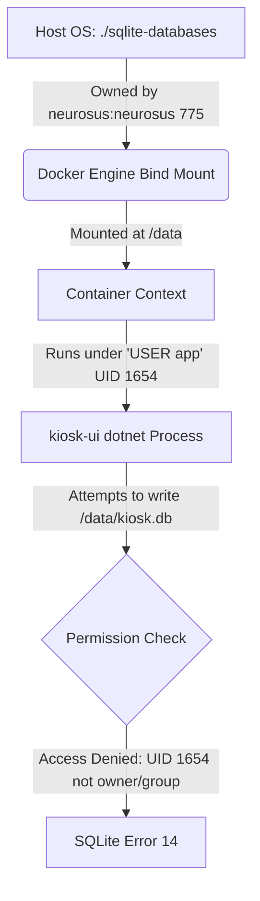

# Troubleshooting & Deployment Guide: SQLite Bind-Mount Permissions in Docker

This guide details the root cause, analysis, and recommended solutions for SQLite file-locking and database creation errors (specifically **SQLite Error 14: unable to open database file**) when running containerized .NET applications using bind-mounted host volumes.

---

## 1. Problem Description

When starting services using Docker Compose, the following exception is thrown by `.NET` services during database initialization (e.g., when calling `EF Core`'s `EnsureCreated` or running migrations):

```text
[14:29:32 ERR] [kiosk-ui] An error occurred using the connection to database 'main' on server '/data/kiosk.db'.
Unhandled exception. Microsoft.Data.Sqlite.SqliteException (0x80004005): SQLite Error 14: 'unable to open database file'.
   at Microsoft.Data.Sqlite.SqliteException.ThrowExceptionForRC(Int32 rc, sqlite3 db)
   at Microsoft.Data.Sqlite.SqliteConnectionInternal..ctor(SqliteConnectionStringBuilder connectionOptions, SqliteConnectionPool pool)
   ...
   at Microsoft.EntityFrameworkCore.Storage.RelationalDatabaseCreator.EnsureCreatedAsync(CancellationToken cancellationToken)
```

---

## 2. Root Cause Analysis

The error occurs due to a mismatch between **container user context permissions** and **host filesystem permissions** on bind-mounted directories.



### Why it Happens:
1. **Container User Isolation (`USER app`)**: Modern ASP.NET base images (from .NET 8.0 onwards) run as a low-privileged user named `app` (UID `1654`, GID `1654`) instead of `root`.
2. **Bind-Mount Behavior**: When bind-mounting a host folder (`./sqlite-databases:/data`), Docker reflects the host directory's exact UID/GID ownership and permission bits inside the container. 
3. **Write Access Denied**: If `./sqlite-databases` is owned by the host user (e.g., `neurosus:neurosus`) with `775` (`drwxrwxr-x`) permissions, the container's `app` user (UID `1654`) falls under the **"others"** permission category. Because "others" only has read-execute (`r-x`) access, the `app` user cannot write to `/data`.
4. **SQLite Writing Lifecycle**: SQLite does not just write to the database file (e.g., `kiosk.db`). It must be able to **create, modify, and delete** auxiliary rollback journal files or Write-Ahead Log files (`kiosk.db-wal` and `kiosk.db-shm`) inside the **parent directory** `/data`. Therefore, the `app` user requires **full read/write/execute permissions on the directory itself**, not just the database file.

---

## 3. Recommended Solutions

Depending on your environment (development vs. production), choose one of the following approaches:

### Option A: Adjust Directory Ownership to Match the Container User (Recommended for Production Bind-Mounts)
Instead of opening the directory to everyone, change the ownership of the host directory to the container's `app` user UID (`1654`).

```bash
# Set ownership of the host database folder to UID 1654 (dotnet app user)
sudo chown -R 1654:1654 ./sqlite-databases
```
* **Pros**: Highly secure. Access is restricted to the specific UID running the application.
* **Cons**: The host user (e.g., `neurosus`) will no longer have direct write access without `sudo`.

---

### Option B: Grant Read/Write/Execute Permissions to Everyone (Recommended for Local Dev)
Make the host directory writable by any user. This is the simplest fix for local development environments where strict security boundaries are not required.

```bash
# Grant read, write, and execute permissions on the directory
chmod 777 ./sqlite-databases
```
* **Pros**: Zero-configuration, works immediately for all users.
* **Cons**: Unrestricted access to the directory on the host machine.

---

### Option C: Override Container User in Docker Compose
You can instruct Docker Compose to run the container using the host user's UID and GID, forcing the process inside the container to execute with the host user's permissions.

Modify `docker-compose.yml` to specify the current user:

```yaml
  kiosk-ui:
    image: vanhoadotbui2628/kiosk-ui:latest
    user: "1000:1000" # Map to host UID:GID (e.g., neurosus UID)
    volumes:
      - ./sqlite-databases:/data
```
* **Pros**: Files created in `./sqlite-databases` will be owned by your host user.
* **Cons**: Bypasses the security advantages of the pre-configured `app` user in the official Microsoft images.

---

### Option D: Use Docker Named Volumes (Best Practice for Non-Host-Inspected Data)
If you do not need to inspect or back up the database files directly from the host system directory structure, use Docker Named Volumes. Docker manages volume creation and configures the permission context automatically for the container user.

Update `docker-compose.yml`:

```yaml
services:
  kiosk-ui:
    ...
    volumes:
      - sqlite-data:/data

volumes:
  sqlite-data: # Docker automatically assigns write permissions for USER app
```
* **Pros**: Standardized Docker pattern, handles permissions automatically.
* **Cons**: DB files are stored in Docker's internal directory (`/var/lib/docker/volumes/`), making them harder to view/edit directly from host CLI.

---

## 4. Verification Check

After applying the permission fix, verify that the SQLite files are initialized correctly:

1. Start the services:
   ```bash
   docker compose up -d
   ```
2. Verify that files are created in the database directory:
   ```bash
   ls -la ./sqlite-databases
   ```
   **Expected Output:**
   ```text
   total 608
   drwxrwxrwx 2 neurosus neurosus  4096 Jun 22 14:56 .
   drwxrwxr-x 9 neurosus neurosus  4096 Jun 22 14:16 ..
   -rw-r--r-- 1 1654     1654      4096 Jun 22 14:56 kiosk.db
   -rw-r--r-- 1 1654     1654     32768 Jun 22 14:56 kiosk.db-shm
   -rw-r--r-- 1 1654     1654    144232 Jun 22 14:56 kiosk.db-wal
   ```
   *(Note the ownership is correctly mapped to container UID `1654` for newly created files).*
