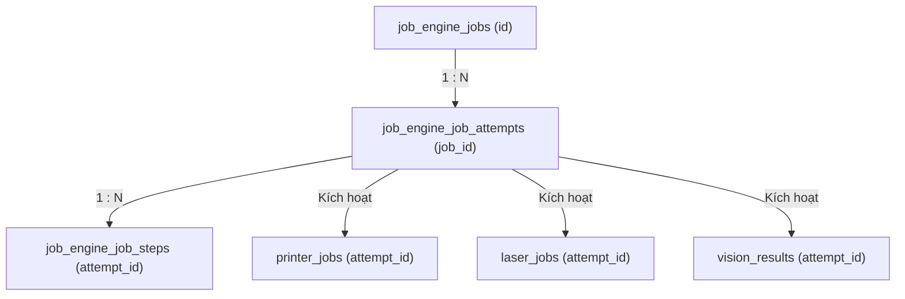

# Từ điển Cơ sở Dữ liệu — Trạm Biên In ấn & Khắc nhãn

Tài liệu này đóng vai trò là danh mục kỹ thuật chuẩn hóa cho các cơ sở dữ liệu của Trạm Biên (Edge Station). Hệ thống triển khai kiến trúc **Database-Per-Service** với **8 cơ sở dữ liệu SQLite cô lập** trên máy tính công nghiệp (IPC) biên.

---

## 1. Tổng quan Hệ thống

| Cơ sở Dữ liệu | Dịch vụ Sở hữu | Vai trò Chính | Số lượng Bảng |
|---|---|---|:---:|
| **`mqtt.db`** | `mqtt-adapter` | Ghi nhật ký tin nhắn & Đệm Outbox truyền thông | 2 |
| **`job_engine.db`** | `job-engine` | Quản lý máy trạng thái & orchestrator thực thi bước | 7 |
| **`kiosk.db`** | `kiosk-ui` | Xác thực, phân quyền RBAC & Nhật ký audit người dùng | 8 |
| **`printer.db`** | `printer-adapter` | Thiết bị máy in, mẫu nhãn, lịch sử in & snapshot phiên bản | 6 |
| **`laser.db`** | `laser-adapter` | Tham số máy khắc laser & nhật ký tác vụ khắc | 3 |
| **`vision.db`** | `vision-service` | Danh mục camera & Kết quả quét camera QC xác thực | 2 |
| **`plc.db`** | `plc-adapter` | Bộ điều khiển PLC, sự kiện & Nhật ký gắp sản phẩm của robot | 4 |
| **`projection.db`** | `projection-service` | Mô hình đọc (read-model) phục vụ Kiosk UI & SignalR | 4 |

Tổng cộng: **36 Bảng** trên **8 cơ sở dữ liệu**.

---

## 2. Chi tiết Lược đồ Cơ sở Dữ liệu

### 2.1 Cơ sở Dữ liệu MQTT (`mqtt.db`)

Chịu trách nhiệm ghi nhật ký các gói tin MQTT gửi đi/nhận về và lưu trữ tạm thời các sự kiện qua mẫu thiết kế Outbox để đảm bảo tin nhắn được gửi thành công về Factory Gateway.

#### Bảng: `mqtt_messages`
Mục đích: Lưu vết toàn bộ lịch sử trao đổi dữ liệu JSON với Factory Gateway.

| Cột | Kiểu | Ràng buộc | Mô tả / Mục đích |
|---|---|---|---|
| `id` | TEXT | PRIMARY KEY, NOT NULL | ID duy nhất của bản ghi |
| `message_id` | TEXT | NOT NULL | ID tương quan chuẩn của tin nhắn MQTT |
| `topic` | TEXT | NOT NULL | Tên chủ đề (Topic) MQTT |
| `payload_json` | TEXT | NOT NULL | Nội dung thô dạng JSON của tin nhắn |
| `direction` | TEXT | NOT NULL | Hướng tin nhắn: `INBOUND` (Nhận vào) hoặc `OUTBOUND` (Gửi đi) |
| `status` | TEXT | NOT NULL | Trạng thái xử lý: `RECEIVED`, `PROCESSED`, `FAILED` |
| `received_at` | TEXT | NOT NULL | Dấu thời gian nhận tin nhắn trên socket |
| `processed_at` | TEXT | NULL | Dấu thời gian hoàn thành xử lý tin nhắn |
| `error_message` | TEXT | NULL | Chi tiết ngoại lệ nếu phân tích hoặc xác thực JSON lỗi |
| `created_at` | TEXT | NOT NULL | Dấu thời gian tạo bản ghi |

#### Bảng: `mqtt_outbox_events`
Mục đích: Triển khai mẫu thiết kế Outbox để đảm bảo mọi sự kiện nghiệp vụ được gửi thành công về Gateway.

| Cột | Kiểu | Ràng buộc | Mô tả / Mục đích |
|---|---|---|---|
| `id` | TEXT | PRIMARY KEY, NOT NULL | ID duy nhất của sự kiện outbox |
| `aggregate_type` | TEXT | NOT NULL | Tên thực thể gốc phát sinh sự kiện (ví dụ: `Job`) |
| `aggregate_id` | TEXT | NOT NULL | Khóa chính của thực thể gốc phát sinh sự kiện |
| `event_type` | TEXT | NOT NULL | Tên sự kiện nghiệp vụ (ví dụ: `PRINT_COMPLETED`) |
| `payload_json` | TEXT | NOT NULL | Dữ liệu sự kiện được tuần tự hóa dạng JSON |
| `topic` | TEXT | NOT NULL | Chủ đề MQTT đích để đồng bộ hóa |
| `status` | TEXT | NOT NULL | Trạng thái outbox: `PENDING`, `PUBLISHED`, `FAILED` |
| `retry_count` | INTEGER | NOT NULL | Số lần thử gửi lại tin nhắn |
| `next_retry_at` | TEXT | NULL | Dấu thời gian chờ trước lần thử tiếp theo |
| `published_at` | TEXT | NULL | Dấu thời gian Factory Gateway xác nhận đã nhận |
| `created_at` | TEXT | NOT NULL | Dấu thời gian tạo bản ghi |

---

### 2.2 Cơ sở Dữ liệu Job Engine (`job_engine.db`)

Điều phối các bước thực thi công việc và quản lý số lần thử lại (retry) khi sản xuất.

#### Bảng: `job_engine_jobs`
Mục đích: Bản ghi master lưu trữ trạng thái của tất cả các công việc sản xuất từ Gateway.

| Cột | Kiểu | Ràng buộc | Mô tả / Mục đích |
|---|---|---|---|
| `id` | TEXT | PRIMARY KEY, NOT NULL | ID duy nhất của Job |
| `job_no` | TEXT | NOT NULL, UNIQUE | Số lệnh sản xuất (Work Order) |
| `source_system` | TEXT | NOT NULL | Hệ thống yêu cầu công việc (ví dụ: `MES`, `ERP`) |
| `job_type` | TEXT | NOT NULL | Loại quy trình sản xuất (ví dụ: `PRINT_ONLY`, `PRINT_AND_MARK`) |
| `current_status` | TEXT | NOT NULL | Trạng thái: `CREATED`, `QUEUED`, `PROCESSING`, `FAILED`, `COMPLETED` |
| `product_code` | TEXT | NOT NULL | Mã sản phẩm SKU |
| `product_serial` | TEXT | NULL | Số sê-ri định danh sản phẩm |
| `payload_json` | TEXT | NOT NULL | Toàn bộ dữ liệu cấu hình/công thức của lệnh sản xuất |
| `priority` | INTEGER | NOT NULL | Độ ưu tiên thực thi công việc (số lớn chạy trước) |
| `idempotency_key` | TEXT | NOT NULL | Khóa chống trùng lặp yêu cầu tạo công việc |
| `completed_at` | TEXT | NULL | Dấu thời gian khi bước cuối cùng kết thúc thành công |
| `parent_job_id` | TEXT | NULL, FK | ID của Job cha nếu thuộc luồng phụ |
| `root_job_id` | TEXT | NULL, FK | ID của Job gốc ban đầu |
| `retry_sequence` | INTEGER | NOT NULL, DEFAULT 0 | Số lượt làm lại (rework) của sản phẩm |
| `execution_type` | TEXT | NULL | Kiểu thực thi: `OriginalProduction` hoặc `Rework` |
| `triggered_by_user_id` | TEXT | NULL | ID của người vận hành nếu thực hiện thủ công |
| `reason_code` | TEXT | NULL | Mã lý do thực hiện làm lại/ghi đè |
| `reason_description` | TEXT | NULL | Mô tả chi tiết ghi đè của người giám sát |
| `created_at` | TEXT | NOT NULL | Dấu thời gian tạo bản ghi |
| `updated_at` | TEXT | NOT NULL | Dấu thời gian cập nhật gần nhất |

**Mối quan hệ:**
* `parent_job_id` trỏ đến `job_engine_jobs.id` (cấu trúc phân cấp Job).
* `root_job_id` trỏ đến `job_engine_jobs.id`.

#### Bảng: `job_engine_job_attempts`
Mục đích: Ghi lại từng lượt thực thi của Job (lượt chạy tự động hoặc chạy lại thủ công).

| Cột | Kiểu | Ràng buộc | Mô tả / Mục đích |
|---|---|---|---|
| `id` | TEXT | PRIMARY KEY, NOT NULL | ID của lượt thực thi |
| `job_id` | TEXT | NOT NULL, FK | Liên kết tới Job chính |
| `attempt_no` | INTEGER | NOT NULL | Số thứ tự lượt chạy (1, 2, 3...) |
| `trigger_type` | TEXT | NOT NULL | Kiểu kích hoạt: `AUTO`, `MANUAL_RETRY`, hoặc `OVERWRITE` |
| `triggered_by_user_id` | TEXT | NULL | Tên tài khoản người vận hành kích hoạt |
| `result_status` | TEXT | NOT NULL | Kết quả lượt chạy: `SUCCESS` hoặc `FAILED` |
| `started_at` | TEXT | NOT NULL | Dấu thời gian bắt đầu chạy |
| `finished_at` | TEXT | NULL | Dấu thời gian kết thúc chạy |
| `error_message` | TEXT | NULL | Nội dung lỗi chính nếu chạy thất bại |
| `parent_attempt_id` | TEXT | NULL, FK | Liên kết tới lượt chạy bị lỗi gốc ban đầu |
| `retry_sequence` | INTEGER | NOT NULL, DEFAULT 0 | Số thứ tự rework |
| `reason_code` | TEXT | NULL | Mã lý do chuẩn hóa |
| `reason_description` | TEXT | NULL | Ghi chú lý do thủ công |
| `created_at` | TEXT | NOT NULL | Dấu thời gian tạo bản ghi |

**Mối quan hệ:**
* `job_id` trỏ đến `job_engine_jobs.id`.
* `parent_attempt_id` trỏ đến `job_engine_job_attempts.id` (liên kết lịch sử retry).

#### Bảng: `job_engine_job_steps`
Mục đích: Chi tiết trạng thái và kết quả của từng bước con (In, Khắc, Vision, PLC) trong một lượt chạy.

| Cột | Kiểu | Ràng buộc | Mô tả / Mục đích |
|---|---|---|---|
| `id` | TEXT | PRIMARY KEY, NOT NULL | ID duy nhất của bước |
| `attempt_id` | TEXT | NOT NULL, FK | Liên kết tới lượt thực thi chính |
| `step_name` | TEXT | NOT NULL | Tên bước: `PRINT`, `LASER_MARK`, `VISION_CHECK` |
| `step_order` | INTEGER | NOT NULL | Thứ tự thực hiện bước (ví dụ: 1, 2, 3) |
| `status` | TEXT | NOT NULL | Trạng thái bước: `QUEUED`, `RUNNING`, `COMPLETED`, `FAILED` |
| `started_at` | TEXT | NULL | Dấu thời gian bắt đầu bước |
| `finished_at` | TEXT | NULL | Dấu thời gian kết thúc bước |
| `result_json` | TEXT | NULL | Dữ liệu trả về từ thiết bị (kích thước ZPL, kết quả scan) |
| `error_message` | TEXT | NULL | Chi tiết lỗi của thiết bị nếu bước thất bại |
| `created_at` | TEXT | NOT NULL | Dấu thời gian tạo bản ghi |

**Mối quan hệ:**
* `attempt_id` trỏ đến `job_engine_job_attempts.id`.

#### Bảng: `job_engine_job_history`
Mục đích: Lưu trữ toàn bộ lịch sử chuyển đổi trạng thái của Job để phục vụ audit.

| Cột | Kiểu | Ràng buộc | Mô tả / Mục đích |
|---|---|---|---|
| `id` | TEXT | PRIMARY KEY, NOT NULL | ID bản ghi lịch sử |
| `job_id` | TEXT | NOT NULL, FK | Liên kết tới Job |
| `attempt_id` | TEXT | NULL, FK | Liên kết tới lượt chạy tương ứng |
| `old_status` | TEXT | NOT NULL | Trạng thái trước khi chuyển |
| `new_status` | TEXT | NOT NULL | Trạng thái sau khi chuyển |
| `action_name` | TEXT | NOT NULL | Tên hành động: `CREATE_JOB`, `RETRY_ATTEMPT`, `CANCEL` |
| `performed_by` | TEXT | NOT NULL | Thành phần hệ thống hoặc ID người thực hiện |
| `note` | TEXT | NULL | Ghi chú thêm |
| `created_at` | TEXT | NOT NULL | Dấu thời gian ghi lại lịch sử |

**Mối quan hệ:**
* `job_id` trỏ đến `job_engine_jobs.id`.
* `attempt_id` trỏ đến `job_engine_job_attempts.id`.

#### Bảng: `job_engine_state_transitions`
Mục đích: Theo dõi và giám sát hoạt động chuyển trạng thái của State Machine.

| Cột | Kiểu | Ràng buộc | Mô tả / Mục đích |
|---|---|---|---|
| `id` | TEXT | PRIMARY KEY, NOT NULL | ID duy nhất bản ghi |
| `job_id` | TEXT | NOT NULL, FK | Liên kết tới Job |
| `from_state` | TEXT | NOT NULL | Trạng thái bắt đầu |
| `to_state` | TEXT | NOT NULL | Trạng thái đích |
| `trigger` | TEXT | NOT NULL | Tên sự kiện kích hoạt chuyển trạng thái |
| `created_at` | TEXT | NOT NULL | Dấu thời gian tạo bản ghi |

**Mối quan hệ:**
* `job_id` trỏ đến `job_engine_jobs.id`.

#### Bảng: `job_engine_overwrite_requests`
Mục đích: Lưu trữ các yêu cầu ghi đè/làm lại thủ công do người vận hành gửi và người giám sát phê duyệt.

| Cột | Kiểu | Ràng buộc | Mô tả / Mục đích |
|---|---|---|---|
| `id` | TEXT | PRIMARY KEY, NOT NULL | ID yêu cầu ghi đè |
| `job_id` | TEXT | NOT NULL, FK | Liên kết tới Job đích |
| `overwrite_type` | TEXT | NOT NULL | Loại ghi đè: `REPRINT`, `RELASER`, `FORCE_PASS`, `FORCE_COMPLETE` |
| `reason` | TEXT | NOT NULL | Lý do nghiệp vụ cần ghi đè |
| `requested_by` | TEXT | NOT NULL | Tài khoản người vận hành yêu cầu |
| `approved_by` | TEXT | NULL | Tài khoản người giám sát phê duyệt |
| `status` | TEXT | NOT NULL | Trạng thái yêu cầu: `PENDING`, `APPROVED`, `REJECTED` |
| `requested_at` | TEXT | NOT NULL | Dấu thời gian yêu cầu |
| `resolved_at` | TEXT | NULL | Dấu thời gian phê duyệt/từ chối |
| `created_at` | TEXT | NOT NULL | Dấu thời gian tạo bản ghi |

**Mối quan hệ:**
* `job_id` trỏ đến `job_engine_jobs.id`.

#### Bảng: `job_engine_outbox_events`
Mục đích: Outbox truyền thông trung tâm lưu các sự kiện từ Job Engine trước khi đẩy lên bus nội bộ.

| Cột | Kiểu | Ràng buộc | Mô tả / Mục đích |
|---|---|---|---|
| `id` | TEXT | PRIMARY KEY, NOT NULL | ID duy nhất outbox |
| `aggregate_type` | TEXT | NOT NULL | Loại thực thể phát sự kiện (ví dụ: `Job`) |
| `aggregate_id` | TEXT | NOT NULL | ID thực thể phát sự kiện |
| `event_type` | TEXT | NOT NULL | Tên sự kiện (ví dụ: `JOB_COMPLETED`) |
| `routing_key` | TEXT | NOT NULL | Khóa định tuyến RabbitMQ đích |
| `payload_json` | TEXT | NOT NULL | Nội dung tin nhắn sự kiện dạng JSON |
| `status` | TEXT | NOT NULL | Trạng thái: `PENDING`, `PUBLISHED`, `FAILED` |
| `retry_count` | INTEGER | NOT NULL | Số lần gửi lại sự kiện |
| `next_retry_at` | TEXT | NULL | Dấu thời gian chờ trước lần thử tiếp theo |
| `published_at` | TEXT | NULL | Dấu thời gian gửi thành công |
| `created_at` | TEXT | NOT NULL | Dấu thời gian tạo bản ghi |

---

### 2.3 Cơ sở Dữ liệu Kiosk UI (`kiosk.db`)

Quản lý thông tin tài khoản người dùng, phân quyền vai trò (RBAC), phiên đăng nhập và lịch sử truy cập.

#### Bảng: `kiosk_users`
Mục đích: Lưu trữ thông tin tài khoản người vận hành và người giám sát.

| Cột | Kiểu | Ràng buộc | Mô tả / Mục đích |
|---|---|---|---|
| `id` | TEXT | PRIMARY KEY, NOT NULL | ID người dùng |
| `username` | TEXT | NOT NULL, UNIQUE | Tên tài khoản đăng nhập duy nhất |
| `full_name` | TEXT | NOT NULL | Họ và tên người dùng |
| `password_hash` | TEXT | NOT NULL | Mã băm mật khẩu bảo mật (BCrypt) |
| `is_active` | INTEGER | NOT NULL | Trạng thái: `1` (Đang hoạt động), `0` (Bị khóa) |
| `created_at` | TEXT | NOT NULL | Dấu thời gian tạo tài khoản |
| `updated_at` | TEXT | NOT NULL | Dấu thời gian cập nhật tài khoản |

#### Bảng: `kiosk_roles`
Mục đích: Lưu định nghĩa các vai trò của người dùng trên trạm.

| Cột | Kiểu | Ràng buộc | Mô tả / Mục đích |
|---|---|---|---|
| `id` | TEXT | PRIMARY KEY, NOT NULL | ID vai trò |
| `role_code` | TEXT | NOT NULL, UNIQUE | Mã vai trò viết hoa (ví dụ: `SUPERVISOR`, `OPERATOR`) |
| `display_name` | TEXT | NOT NULL | Tên hiển thị thân thiện |
| `created_at` | TEXT | NOT NULL | Dấu thời gian tạo vai trò |

#### Bảng: `kiosk_permissions`
Mục đích: Lưu định nghĩa các quyền thao tác trong hệ thống.

| Cột | Kiểu | Ràng buộc | Mô tả / Mục đích |
|---|---|---|---|
| `id` | TEXT | PRIMARY KEY, NOT NULL | ID quyền |
| `permission_code` | TEXT | NOT NULL, UNIQUE | Mã quyền hệ thống (ví dụ: `JOB_RETRY`, `JOB_FORCE_PASS`) |
| `description` | TEXT | NOT NULL | Mô tả chi tiết phạm vi quyền |
| `created_at` | TEXT | NOT NULL | Dấu thời gian tạo quyền |

#### Bảng: `kiosk_user_roles`
Mục đích: Ánh xạ người dùng vào các vai trò tương ứng.

| Cột | Kiểu | Ràng buộc | Mô tả / Mục đích |
|---|---|---|---|
| `id` | TEXT | PRIMARY KEY, NOT NULL | ID bản ghi |
| `user_id` | TEXT | NOT NULL, FK | Liên kết tới người dùng |
| `role_id` | TEXT | NOT NULL, FK | Liên kết tới vai trò |
| `assigned_at` | TEXT | NOT NULL | Dấu thời gian gán vai trò |
| `assigned_by` | TEXT | NOT NULL | Người thực hiện gán vai trò |
| `created_at` | TEXT | NOT NULL | Dấu thời gian tạo bản ghi |

**Mối quan hệ:**
* `user_id` trỏ đến `kiosk_users.id`.
* `role_id` trỏ đến `kiosk_roles.id`.

#### Bảng: `kiosk_user_permissions`
Mục đích: Gán quyền trực tiếp cho một tài khoản cụ thể mà không cần qua vai trò.

| Cột | Kiểu | Ràng buộc | Mô tả / Mục đích |
|---|---|---|---|
| `id` | TEXT | PRIMARY KEY, NOT NULL | ID bản ghi |
| `user_id` | TEXT | NOT NULL, FK | Liên kết tới người dùng |
| `permission_id` | TEXT | NOT NULL, FK | Liên kết tới quyền |
| `created_at` | TEXT | NOT NULL | Dấu thời gian tạo bản ghi |

**Mối quan hệ:**
* `user_id` trỏ đến `kiosk_users.id`.
* `permission_id` trỏ đến `kiosk_permissions.id`.

#### Bảng: `kiosk_role_permissions`
Mục đích: Thiết lập ma trận quyền hạn cho từng vai trò.

| Cột | Kiểu | Ràng buộc | Mô tả / Mục đích |
|---|---|---|---|
| `id` | TEXT | PRIMARY KEY, NOT NULL | ID bản ghi |
| `role_id` | TEXT | NOT NULL, FK | Liên kết tới vai trò |
| `permission_id` | TEXT | NOT NULL, FK | Liên kết tới quyền |
| `created_at` | TEXT | NOT NULL | Dấu thời gian tạo bản ghi |

**Mối quan hệ:**
* `role_id` trỏ đến `kiosk_roles.id`.
* `permission_id` trỏ đến `kiosk_permissions.id`.

#### Bảng: `kiosk_sessions`
Mục đích: Quản lý các phiên đăng nhập và token JWT đang hoạt động.

| Cột | Kiểu | Ràng buộc | Mô tả / Mục đích |
|---|---|---|---|
| `id` | TEXT | PRIMARY KEY, NOT NULL | ID phiên đăng nhập |
| `user_id` | TEXT | NOT NULL, FK | Liên kết tới người dùng |
| `token` | TEXT | NOT NULL | Mã token JWT |
| `ip_address` | TEXT | NOT NULL | Địa chỉ IP máy trạm đăng nhập |
| `user_agent` | TEXT | NOT NULL | Thông tin trình duyệt/hệ điều hành |
| `login_at` | TEXT | NOT NULL | Dấu thời gian đăng nhập |
| `expires_at` | TEXT | NOT NULL | Dấu thời gian hết hạn phiên |
| `logout_at` | TEXT | NULL | Dấu thời gian đăng xuất chủ động |
| `is_active` | INTEGER | NOT NULL | Trạng thái hoạt động: `1` (Còn hạn), `0` (Hết hạn) |
| `created_at` | TEXT | NOT NULL | Dấu thời gian tạo bản ghi |

**Mối quan hệ:**
* `user_id` trỏ đến `kiosk_users.id`.

#### Bảng: `kiosk_access_logs`
Mục đích: Nhật ký vết kiểm toán (Audit Trail) cho mọi thao tác quan trọng trên màn hình Kiosk.

| Cột | Kiểu | Ràng buộc | Mô tả / Mục đích |
|---|---|---|---|
| `id` | TEXT | PRIMARY KEY, NOT NULL | ID nhật ký |
| `user_id` | TEXT | NOT NULL, FK | Liên kết tới người dùng thực hiện |
| `session_id` | TEXT | NOT NULL, FK | Phiên làm việc tương ứng |
| `action_name` | TEXT | NOT NULL | Hành động thao tác (ví dụ: `REPRINT`, `FORCE_PASS`) |
| `target_type` | TEXT | NOT NULL | Loại thực thể bị tác động: `JOB`, `USER`, `CONFIG` |
| `target_id` | TEXT | NOT NULL | Khóa chính thực thể bị tác động |
| `result` | TEXT | NOT NULL | Kết quả thực thi: `SUCCESS` hoặc `FAILED` |
| `detail_json` | TEXT | NULL | JSON chứa giá trị thay đổi chi tiết |
| `performed_at` | TEXT | NOT NULL | Dấu thời gian thực hiện thao tác |
| `created_at` | TEXT | NOT NULL | Dấu thời gian tạo bản ghi |

**Mối quan hệ:**
* `user_id` trỏ đến `kiosk_users.id`.
* `session_id` trỏ đến `kiosk_sessions.id`.

---

### 2.4 Cơ sở Dữ liệu Máy in (`printer.db`)

Lưu cấu hình máy in nhãn, thiết kế mẫu nhãn dạng JSON từ Studio, lịch sử các phiên bản thiết kế và lịch sử lệnh gửi in nhãn ZPL.

#### Bảng: `label_templates`
Mục đích: Kho chứa chính các mẫu thiết kế nhãn từ Zebra Label Studio.

| Cột | Kiểu | Ràng buộc | Mô tả / Mục đích |
|---|---|---|---|
| `id` | TEXT | PRIMARY KEY, NOT NULL | ID duy nhất của mẫu nhãn |
| `name` | TEXT | NOT NULL | Tên mẫu nhãn |
| `description` | TEXT | NULL | Mô tả công dụng mẫu nhãn |
| `dpi` | INTEGER | NOT NULL | Độ phân giải mục tiêu của máy in (203, 300, 600) |
| `label_width` | REAL | NOT NULL | Chiều rộng nhãn thiết kế (mm) |
| `label_height` | REAL | NOT NULL | Chiều cao nhãn thiết kế (mm) |
| `template_json` | TEXT | NOT NULL | Cấu trúc JSON chứa tọa độ và kiểu các phần tử nhãn |
| `version` | INTEGER | NOT NULL | Phiên bản hiện tại của nhãn |
| `is_active` | INTEGER | NOT NULL | Trạng thái: `1` (Đang sử dụng), `0` (Ngừng dùng) |
| `created_at` | TEXT | NOT NULL | Dấu thời gian tạo mẫu |
| `updated_at` | TEXT | NOT NULL | Dấu thời gian cập nhật mẫu nhãn gần nhất |

#### Bảng: `label_template_versions`
Mục đích: Snapshot lưu các phiên bản cũ của mẫu nhãn phục vụ in lại lịch sử.

| Cột | Kiểu | Ràng buộc | Mô tả / Mục đích |
|---|---|---|---|
| `id` | TEXT | PRIMARY KEY, NOT NULL | ID duy nhất bản ghi |
| `template_id` | TEXT | NOT NULL, FK | Liên kết tới mẫu nhãn gốc |
| `version` | INTEGER | NOT NULL | Số thứ tự phiên bản snapshot |
| `template_json` | TEXT | NOT NULL | JSON cấu trúc thiết kế nhãn tại phiên bản đó |
| `created_by` | TEXT | NULL | Người thực hiện lưu phiên bản |
| `created_at` | TEXT | NOT NULL | Dấu thời gian tạo bản snapshot |

**Mối quan hệ:**
* `template_id` trỏ đến `label_templates.id`. Chỉ số kết hợp `{template_id, version}` là duy nhất.

#### Bảng: `print_history`
Mục đích: Ghi vết chi tiết toàn bộ các lượt gửi lệnh in, giá trị dữ liệu và nội dung ZPL thực tế gửi đi.

| Cột | Kiểu | Ràng buộc | Mô tả / Mục đích |
|---|---|---|---|
| `id` | TEXT | PRIMARY KEY, NOT NULL | ID lượt in |
| `template_id` | TEXT | NOT NULL, FK | Liên kết mẫu nhãn được in |
| `template_name` | TEXT | NOT NULL | Tên mẫu nhãn tại thời điểm in |
| `template_version` | INTEGER | NOT NULL | Phiên bản mẫu nhãn được in |
| `printer_code` | TEXT | NOT NULL | Mã máy in thực hiện lệnh |
| `runtime_data_json` | TEXT | NOT NULL | Giá trị các biến động được điền vào placeholders |
| `rendered_zpl` | TEXT | NOT NULL | Nội dung mã ZPL sau khi render hoàn chỉnh |
| `tcp_request_hex` | TEXT | NULL | Dữ liệu dạng hex thô gửi qua TCP socket |
| `tcp_response_hex` | TEXT | NULL | Dữ liệu phản hồi dạng hex thô nhận được từ máy in |
| `printer_result` | TEXT | NULL | Phản hồi máy in sau phân tích (ví dụ: `ACK`, `BUSY`) |
| `status` | TEXT | NOT NULL | Kết quả in: `SUCCESS` hoặc `FAILED` |
| `duration_ms` | INTEGER | NOT NULL | Thời gian thực thi kết nối socket và truyền tải nhãn |
| `retry_count` | INTEGER | NOT NULL | Số lần thực hiện gửi lại lệnh in nhãn |
| `trace_id` | TEXT | NOT NULL | ID vết giao dịch phân tán |
| `correlation_id` | TEXT | NOT NULL | ID tương quan nghiệp vụ |
| `exception_message` | TEXT | NULL | Lỗi exception chi tiết nếu kết nối socket bị sập |
| `timeline_json` | TEXT | NULL | Chuỗi mốc thời gian chi tiết của tiến trình gửi in nhãn |
| `created_at` | TEXT | NOT NULL | Dấu thời gian tạo bản ghi |

**Mối quan hệ:**
* `template_id` trỏ đến `label_templates.id`.

#### Bảng: `printer_printers`
Mục đích: Danh mục máy in nhãn trong nhà máy.

| Cột | Kiểu | Ràng buộc | Mô tả / Mục đích |
|---|---|---|---|
| `id` | TEXT | PRIMARY KEY, NOT NULL | ID máy in |
| `printer_code` | TEXT | NOT NULL, UNIQUE | Mã máy in duy nhất (ví dụ: `PRINTER-01`) |
| `display_name` | TEXT | NOT NULL | Tên hiển thị thân thiện |
| `ip_address` | TEXT | NOT NULL | Địa chỉ IP mạng máy in |
| `port` | INTEGER | NOT NULL | Cổng TCP (mặc định là `9100`) |
| `protocol` | TEXT | NOT NULL | Ngôn ngữ máy in (ví dụ: `ZPL`, `EPL`) |
| `vendor` | TEXT | NOT NULL | Hãng sản xuất (ví dụ: `ZEBRA`, `HONEYWELL`) |
| `status` | TEXT | NOT NULL | Trạng thái: `ONLINE`, `BUSY`, `OFFLINE` |
| `group_id` | TEXT | NULL | Mã nhóm/dây chuyền |
| `last_heartbeat_at` | TEXT | NULL | Dấu thời gian kiểm tra nhịp tim gần nhất |
| `created_at` | TEXT | NOT NULL | Dấu thời gian tạo bản ghi |

#### Bảng: `printer_jobs`
Mục đích: Tiếp nhận và xử lý tác vụ in từ Job Engine gửi sang.

| Cột | Kiểu | Ràng buộc | Mô tả / Mục đích |
|---|---|---|---|
| `id` | TEXT | PRIMARY KEY, NOT NULL | ID lệnh in |
| `job_id` | TEXT | NOT NULL | ID công việc chung |
| `attempt_id` | TEXT | NOT NULL | ID lượt chạy công việc |
| `printer_id` | TEXT | NOT NULL, FK | Liên kết tới máy in thực hiện |
| `label_template` | TEXT | NOT NULL | Định danh mẫu nhãn |
| `rendered_content` | TEXT | NOT NULL | Dữ liệu ZPL đã render hoàn chỉnh |
| `print_status` | TEXT | NOT NULL | Trạng thái: `PENDING`, `SUCCESS`, `FAILED` |
| `copies` | INTEGER | NOT NULL | Số bản in cần tạo |
| `sent_at` | TEXT | NULL | Dấu thời gian bắt đầu truyền socket |
| `finished_at` | TEXT | NULL | Dấu thời gian kết thúc truyền socket |
| `error_message` | TEXT | NULL | Lỗi socket phát sinh |
| `created_at` | TEXT | NOT NULL | Dấu thời gian tạo bản ghi |

**Mối quan hệ:**
* `printer_id` trỏ đến `printer_printers.id`.

#### Bảng: `printer_events`
Mục đích: Lưu trữ nhật ký sự kiện phần cứng do máy in báo về.

| Cột | Kiểu | Ràng buộc | Mô tả / Mục đích |
|---|---|---|---|
| `id` | TEXT | PRIMARY KEY, NOT NULL | ID sự kiện |
| `printer_id` | TEXT | NOT NULL, FK | Liên kết tới máy in |
| `event_type` | TEXT | NOT NULL | Loại lỗi phần cứng: `PAPER_OUT`, `HEAD_OPEN`, `RIBBON_OUT` |
| `event_data` | TEXT | NULL | Thông tin chẩn đoán kỹ thuật thêm |
| `occurred_at` | TEXT | NOT NULL | Dấu thời gian phát sinh sự kiện |
| `created_at` | TEXT | NOT NULL | Dấu thời gian tạo bản ghi |

**Mối quan hệ:**
* `printer_id` trỏ đến `printer_printers.id`.

---

### 2.5 Cơ sở Dữ liệu Máy khắc Laser (`laser.db`)

Lưu cấu hình máy khắc, lịch sử lệnh khắc và các sự kiện khóa an toàn đầu khắc.

#### Bảng: `laser_lasers`
Mục đích: Danh mục máy khắc laser trên các dây chuyền.

| Cột | Kiểu | Ràng buộc | Mô tả / Mục đích |
|---|---|---|---|
| `id` | TEXT | PRIMARY KEY, NOT NULL | ID máy khắc |
| `laser_code` | TEXT | NOT NULL, UNIQUE | Mã máy khắc duy nhất (ví dụ: `LASER-01`) |
| `display_name` | TEXT | NOT NULL | Tên hiển thị thân thiện |
| `connection_type` | TEXT | NOT NULL | Phương thức kết nối: `TCP`, `SDK_DLL` |
| `endpoint` | TEXT | NOT NULL | Địa chỉ đích mạng (IP:Port) |
| `vendor` | TEXT | NOT NULL | Hãng sản xuất (ví dụ: `KEYENCE`, `TRUMPF`) |
| `status` | TEXT | NOT NULL | Trạng thái: `ONLINE`, `MARKING`, `OFFLINE`, `FAULT` |
| `last_heartbeat_at` | TEXT | NULL | Dấu thời gian kiểm tra nhịp tim gần nhất |
| `created_at` | TEXT | NOT NULL | Dấu thời gian tạo bản ghi |

#### Bảng: `laser_jobs`
Mục đích: Quản lý các lệnh thực hiện khắc laser do Job Engine gửi sang.

| Cột | Kiểu | Ràng buộc | Mô tả / Mục đích |
|---|---|---|---|
| `id` | TEXT | PRIMARY KEY, NOT NULL | ID lệnh khắc |
| `job_id` | TEXT | NOT NULL | ID công việc chung |
| `attempt_id` | TEXT | NOT NULL | ID lượt chạy công việc |
| `laser_id` | TEXT | NOT NULL, FK | Liên kết tới máy khắc thực hiện |
| `template_name` | TEXT | NOT NULL | Tên mẫu cấu hình khắc được chọn |
| `mark_content` | TEXT | NOT NULL | Nội dung sê-ri hoặc chuỗi ký tự gửi tới máy khắc |
| `mark_status` | TEXT | NOT NULL | Trạng thái: `PENDING`, `SUCCESS`, `FAILED` |
| `sent_at` | TEXT | NULL | Dấu thời gian gửi lệnh thành công |
| `finished_at` | TEXT | NULL | Dấu thời gian máy khắc báo đã khắc xong |
| `error_message` | TEXT | NULL | Chi tiết lỗi từ bộ điều khiển laser |
| `created_at` | TEXT | NOT NULL | Dấu thời gian tạo bản ghi |

**Mối quan hệ:**
* `laser_id` trỏ đến `laser_lasers.id`.

#### Bảng: `laser_events`
Mục đích: Lưu sự kiện cảnh báo cảm biến an toàn và lỗi chùm tia laser.

| Cột | Kiểu | Ràng buộc | Mô tả / Mục đích |
|---|---|---|---|
| `id` | TEXT | PRIMARY KEY, NOT NULL | ID sự kiện |
| `laser_id` | TEXT | NOT NULL, FK | Liên kết máy khắc xảy ra sự kiện |
| `event_type` | TEXT | NOT NULL | Loại sự kiện: `SAFETY_OPEN`, `BEAM_FAULT`, `TEMP_WARN` |
| `event_data` | TEXT | NULL | Thông tin chẩn đoán kỹ thuật |
| `occurred_at` | TEXT | NOT NULL | Dấu thời gian xảy ra sự kiện |
| `created_at` | TEXT | NOT NULL | Dấu thời gian tạo bản ghi |

**Mối quan hệ:**
* `laser_id` trỏ đến `laser_lasers.id`.

---

### 2.6 Cơ sở Dữ liệu Hệ thống Thị giác (`vision.db`)

Lưu cấu hình camera QC và kết quả chụp ảnh xác thực sản phẩm đầu ra.

#### Bảng: `vision_cameras`
Mục đích: Danh mục camera kiểm tra chất lượng sản phẩm.

| Cột | Kiểu | Ràng buộc | Mô tả / Mục đích |
|---|---|---|---|
| `id` | TEXT | PRIMARY KEY, NOT NULL | ID camera |
| `camera_code` | TEXT | NOT NULL, UNIQUE | Mã camera duy nhất (ví dụ: `CAM-01`) |
| `display_name` | TEXT | NOT NULL | Tên hiển thị thân thiện |
| `connection_type` | TEXT | NOT NULL | Kiểu kết nối: `REST_HTTP`, `TCP_RAW`, `SDK` |
| `endpoint` | TEXT | NULL | Đường dẫn gọi API mạng hoặc địa chỉ IP |
| `status` | TEXT | NOT NULL | Trạng thái hoạt động: `ONLINE`, `CAPTURING`, `OFFLINE` |
| `last_heartbeat_at` | TEXT | NULL | Dấu thời gian kiểm tra nhịp tim gần nhất |
| `created_at` | TEXT | NOT NULL | Dấu thời gian tạo bản ghi |

#### Bảng: `vision_results`
Mục đích: Kết quả phân tích OCR, quét mã vạch và nhận diện của camera.

| Cột | Kiểu | Ràng buộc | Mô tả / Mục đích |
|---|---|---|---|
| `id` | TEXT | PRIMARY KEY, NOT NULL | ID lượt quét QC |
| `job_id` | TEXT | NOT NULL | ID công việc chung |
| `attempt_id` | TEXT | NOT NULL | ID lượt chạy công việc |
| `camera_id` | TEXT | NOT NULL, FK | Máy ảnh thực hiện kiểm tra |
| `inspection_result` | TEXT | NOT NULL | Kết quả: `VERIFIED_PASS` hoặc `VERIFIED_FAIL` |
| `defect_code` | TEXT | NULL | Mã lỗi QC phát hiện (ví dụ: `OCR_MISMATCH`) |
| `confidence_score` | REAL | NULL | Mức độ tin cậy nhận diện của AI (`0.0` - `1.0`) |
| `ocr_text` | TEXT | NULL | Chuỗi văn bản đọc được bằng OCR |
| `barcode_value` | TEXT | NULL | Giá trị mã vạch camera giải mã được |
| `image_path` | TEXT | NOT NULL | Đường dẫn lưu ảnh chụp chất lượng cao trên ổ đĩa |
| `inspected_at` | TEXT | NOT NULL | Dấu thời gian thực hiện chụp quét |
| `created_at` | TEXT | NOT NULL | Dấu thời gian tạo bản ghi |

**Mối quan hệ:**
* `camera_id` trỏ đến `vision_cameras.id`.

---

### 2.7 Cơ sở Dữ liệu PLC (`plc.db`)

Lưu cấu hình thiết bị PLC, sự kiện cảm biến và robot gắp, cùng lệnh gửi xuống thanh ghi PLC.

#### Bảng: `plc_devices`
Mục đích: Danh mục bộ điều khiển lập trình (PLC) trên dây chuyền.

| Cột | Kiểu | Ràng buộc | Mô tả / Mục đích |
|---|---|---|---|
| `id` | TEXT | PRIMARY KEY, NOT NULL | ID PLC |
| `plc_code` | TEXT | NOT NULL, UNIQUE | Mã PLC duy nhất (ví dụ: `PLC-01`) |
| `display_name` | TEXT | NOT NULL | Tên hiển thị thân thiện |
| `protocol` | TEXT | NOT NULL | Giao thức truyền thông (ví dụ: `MODBUS_TCP`, `PROFINET`) |
| `ip_address` | TEXT | NOT NULL | Địa chỉ IP mạng của PLC |
| `port` | INTEGER | NOT NULL | Cổng mạng giao tiếp (Modbus thường dùng `502`) |
| `status` | TEXT | NOT NULL | Trạng thái hoạt động: `ONLINE`, `RUNNING`, `OFFLINE` |
| `last_heartbeat_at` | TEXT | NULL | Dấu thời gian kiểm tra nhịp tim gần nhất |
| `created_at` | TEXT | NOT NULL | Dấu thời gian tạo bản ghi |

#### Bảng: `plc_commands`
Mục đích: Nhật ký lệnh gửi tới PLC điều khiển băng tải hoặc cánh tay robot.

| Cột | Kiểu | Ràng buộc | Mô tả / Mục đích |
|---|---|---|---|
| `id` | TEXT | PRIMARY KEY, NOT NULL | ID lệnh PLC |
| `job_id` | TEXT | NOT NULL | ID công việc chung |
| `attempt_id` | TEXT | NOT NULL | ID lượt chạy công việc |
| `plc_id` | TEXT | NOT NULL, FK | Liên kết tới PLC đích nhận lệnh |
| `command_name` | TEXT | NOT NULL | Tên lệnh (ví dụ: `STOP_CONVEYOR`, `ROUTE_REJECT`) |
| `command_payload` | TEXT | NOT NULL | Dữ liệu dạng JSON ghi vào các thanh ghi |
| `execution_status` | TEXT | NOT NULL | Trạng thái: `PENDING`, `SUCCESS`, `FAILED` |
| `sent_at` | TEXT | NULL | Dấu thời gian gửi lệnh đi |
| `finished_at` | TEXT | NULL | Dấu thời gian PLC xác nhận đã thực thi |
| `error_message` | TEXT | NULL | Lỗi phản hồi từ PLC nếu ghi thất bại |
| `created_at` | TEXT | NOT NULL | Dấu thời gian tạo bản ghi |

**Mối quan hệ:**
* `plc_id` trỏ đến `plc_devices.id`.

#### Bảng: `plc_events`
Mục đích: Nhật ký thay đổi trạng thái các thanh ghi đầu vào (sensors) quét được từ PLC.

| Cột | Kiểu | Ràng buộc | Mô tả / Mục đích |
|---|---|---|---|
| `id` | TEXT | PRIMARY KEY, NOT NULL | ID sự kiện |
| `plc_id` | TEXT | NOT NULL, FK | Liên kết tới PLC phát sinh |
| `event_type` | TEXT | NOT NULL | Loại sự kiện: `PRODUCT_DETECTED`, `FAULT_TRIPPED` |
| `event_data` | TEXT | NULL | JSON chứa giá trị thanh ghi đọc được |
| `occurred_at` | TEXT | NOT NULL | Dấu thời gian xảy ra sự kiện |
| `created_at` | TEXT | NOT NULL | Dấu thời gian tạo bản ghi |

**Mối quan hệ:**
* `plc_id` trỏ đến `plc_devices.id`.

#### Bảng: `plc_robot_pick_events`
Mục đích: Lưu vết hoạt động gắp sản phẩm của cánh tay robot.

| Cột | Kiểu | Ràng buộc | Mô tả / Mục đích |
|---|---|---|---|
| `id` | TEXT | PRIMARY KEY, NOT NULL | ID lượt gắp |
| `job_id` | TEXT | NOT NULL | ID công việc chung |
| `attempt_id` | TEXT | NOT NULL | ID lượt chạy công việc |
| `plc_id` | TEXT | NOT NULL, FK | Liên kết tới PLC điều khiển robot |
| `pick_result` | TEXT | NOT NULL | Kết quả gắp: `SUCCESS`, `MISSED`, `DROPPED` |
| `pick_position` | TEXT | NULL | Tọa độ hoặc mã ngăn gắp sản phẩm |
| `error_code` | TEXT | NULL | Mã lỗi của robot nếu gắp trượt |
| `occurred_at` | TEXT | NOT NULL | Dấu thời gian thực hiện gắp |
| `created_at` | TEXT | NOT NULL | Dấu thời gian tạo bản ghi |

**Mối quan hệ:**
* `plc_id` trỏ đến `plc_devices.id`.

---

### 2.8 Cơ sở Dữ liệu Projection (`projection.db`)

Hoạt động như một bộ đệm (mô hình đọc tối ưu hóa) để hiển thị nhanh màn hình Kiosk UI và đẩy dữ liệu thời gian thực qua SignalR Hub.

#### Bảng: `projection_production_records`
Mục đích: Bản ghi rút gọn tối ưu hóa mô hình đọc chứa trạng thái các công việc đang sản xuất.

| Cột | Kiểu | Ràng buộc | Mô tả / Mục đích |
|---|---|---|---|
| `id` | TEXT | PRIMARY KEY, NOT NULL | ID bản ghi |
| `job_id` | TEXT | NOT NULL | ID của Job gốc |
| `job_no` | TEXT | NOT NULL | Số lệnh sản xuất |
| `product_code` | TEXT | NOT NULL | Mã sản phẩm SKU |
| `product_serial` | TEXT | NULL | Số sê-ri sản phẩm |
| `job_type` | TEXT | NOT NULL | Loại công việc (ví dụ: `PRINT_ONLY`) |
| `current_status` | TEXT | NOT NULL | Trạng thái (ví dụ: `COMPLETED`, `WAIT_REWORK`) |
| `station_id` | TEXT | NOT NULL | ID của trạm biên |
| `updated_at` | TEXT | NOT NULL | Dấu thời gian cập nhật gần nhất |
| `created_at` | TEXT | NOT NULL | Dấu thời gian tạo bản ghi |

#### Bảng: `projection_device_status`
Mục đích: Cập nhật trực quan nhanh trạng thái Online/Offline của các thiết bị phần cứng.

| Cột | Kiểu | Ràng buộc | Mô tả / Mục đích |
|---|---|---|---|
| `id` | TEXT | PRIMARY KEY, NOT NULL | ID bản ghi |
| `device_id` | TEXT | NOT NULL | Mã định danh thiết bị |
| `device_type` | TEXT | NOT NULL | Loại thiết bị: `PRINTER`, `LASER`, `VISION`, `PLC` |
| `is_online` | INTEGER | NOT NULL | Trạng thái kết nối: `1` (Online), `0` (Offline) |
| `last_seen_at` | TEXT | NOT NULL | Dấu thời gian hoạt động cuối cùng |
| `created_at` | TEXT | NOT NULL | Dấu thời gian tạo bản ghi |

#### Bảng: `projection_activity_log`
Mục đích: Nhật ký tổng hợp các bước chạy thời gian thực hiển thị danh sách nhật ký trên Kiosk.

| Cột | Kiểu | Ràng buộc | Mô tả / Mục đích |
|---|---|---|---|
| `id` | TEXT | PRIMARY KEY, NOT NULL | ID bản ghi |
| `event_type` | TEXT | NOT NULL | Tên sự kiện (ví dụ: `PRINT_FAILED`) |
| `job_id` | TEXT | NOT NULL | Liên kết tới Job |
| `job_no` | TEXT | NOT NULL | Số lệnh sản xuất |
| `product_code` | TEXT | NOT NULL | Mã sản phẩm SKU |
| `status` | TEXT | NOT NULL | Trạng thái thực thi hiện tại |
| `message` | TEXT | NOT NULL | Chuỗi văn bản mô tả sự kiện |
| `occurred_at` | TEXT | NOT NULL | Dấu thời gian xảy ra sự kiện |
| `created_at` | TEXT | NOT NULL | Dấu thời gian tạo bản ghi |

#### Bảng: `projection_production_view`
Mục đích: Mô hình đọc phẳng hóa tối đa tối ưu hiển thị danh sách bảng công việc trên Kiosk UI.

| Cột | Kiểu | Ràng buộc | Mô tả / Mục đích |
|---|---|---|---|
| `id` | TEXT | PRIMARY KEY, NOT NULL | ID bản ghi |
| `station_id` | TEXT | NOT NULL | ID trạm biên |
| `job_id` | TEXT | NOT NULL | ID Job tương ứng |
| `work_order_no` | TEXT | NOT NULL | Số lệnh sản xuất |
| `product_code` | TEXT | NOT NULL | Mã sản phẩm SKU |
| `product_serial` | TEXT | NULL | Số sê-ri sản phẩm |
| `job_status` | TEXT | NOT NULL | Trạng thái Job |
| `updated_at` | TEXT | NOT NULL | Dấu thời gian cập nhật gần nhất |
| `created_at` | TEXT | NOT NULL | Dấu thời gian tạo bản ghi |

---

## 3. Các Luồng Nghiệp vụ & Khóa Liên kết Toàn cục

Các cơ sở dữ liệu biên được liên kết chặt chẽ thông qua các trường ID duy nhất (`job_id`, `attempt_id`) đi kèm trong payload của các sự kiện truyền tin.

### 3.1 Sơ đồ Phân cấp Thực thi Job

### 3.2 Luồng Lịch sử Kiểm toán & Ghi đè Thủ công
Khi một lượt chạy công việc bị lỗi:
1. `job_engine_jobs.current_status` cập nhật thành `WAIT_REWORK`.
2. Người vận hành đăng nhập Kiosk UI, tạo bản ghi trong `kiosk_sessions` và ghi vết `kiosk_access_logs`.
3. Người vận hành yêu cầu thực hiện làm lại, tạo bản ghi `job_engine_overwrite_requests`.
4. Khi được phê duyệt bởi người giám sát, trạng thái chuyển thành `APPROVED`, kích hoạt một lượt thực thi mới trong `job_engine_job_attempts` (ví dụ: `attempt_no = 2`, `trigger_type = OVERWRITE`).
5. Kết quả in ấn mới được cập nhật vào `printer_jobs` (nếu in lại) hoặc lịch sử `print_history` (in nhãn động).
